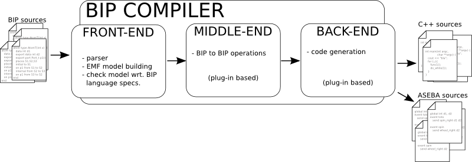

Compiler and Engines presentation
=================================

The compiler
------------

The compiler consists of three parts that will be presented in more details in
the following sections:

* the *front-end* : it interacts with the user of the compiler. It
  reads user input and transforms it in a form suitable for the following
  process (*ie.* internal representation).
* the *middle-end* : applies operations on the internal representation (*eg.*
  optimizations, architectural transformations, ...). One such operation is
  contained into a small *block* in the compiler that we will call *filter*
  later on.
* the *back-end* : produces the final result from the internal
  representation. Usually in the form of a source code in a programming language
  (*eg.* C++). Several back-ends can be used at once.

   Overview of Compiler design

A typical compilation consists of the following steps:

* first, the front-end executes and creates a *BIP-EMF* model
* then the *filters* in the middle-end are executed in turn. The result is 
  a possibly modified *BIP-EMF* model.
* finally, all back-ends are executed in turn. Their results are the compilation
  results.

The Front-End
^^^^^^^^^^^^^
.. index::
   single: front-end

This part is responsible for reading user input (*ie.* BIP source code & command
line argument) and transforming it into an intermediate representation that will
be used throughout the other parts of the compiler. The current front-end
contains a parser for the BIP language and a BIP meta-model that describes the
intermediate representation. An instance of a BIP model represented in the BIP
meta-model is called a *BIP-EMF model* (because it is a BIP model expressed
using the `Eclipse Modeling Framework (EMF) <http://www.eclipse.org/emf>`_
technology) in the following text. For more details on the internals, see
:ref:`dev-doc-frontend-label`.

Type model versus Instance model
""""""""""""""""""""""""""""""""

The BIP language only deals with *types*. There is no support for running
entities, even if the final result should be a running system. This *missing*
information is usually filled by specifying a *root* component at compile
time. The compiler (*ie.* the front-end) is then able to build both a type model
(*ie.* a representation of the BIP source code given as input) and an *instance*
model that represents the system you want to run. The distinction between the
two can be subtle, especially when the concept of *declaration* is mixed in
between:

* a component type describes the *shape* of an instance of that type
* a component declaration instructs the creation of an instance of a component
  type
* a component instance is a *running* entity

These notions are similar to class/instance/object declaration that can be found
in object oriented language. For example, in Java:

* a component type = a class::

    public class MyClass { ... }

* a component (instance of a component type) = an object (instance of a class)::

    new MyClass();

* a component declaration = an object declaration::

    MyClass m;

Beware that a component declaration can trigger the creation of more than one
instance. A component declaration usually *is not* a discriminant component
identifier within the whole system.

The Middle-End
^^^^^^^^^^^^^^

.. index::
   single: middle-end
   single: bip2bip

The middle-end hosts all the *BIP to BIP* transformations. It acts on the
*BIP-EMF* model by means of operations (but are not limited to):

* architectural modifications (*eg.* flattening, component injection, ...)
* petri net simplifications
* dead code removal
* data collection

The compiler currently does not have any such operation: the middle-end is
empty. See :ref:`dev-doc-middleend-label` for more details.

.. figure: ../images/missing-todo.png
   
   Missing figure for middle end

.. Maybe we should have ref to research paper dealing with bip2bip transformations ?

The Back-End
^^^^^^^^^^^^

.. index::
   single: back-end

The back-end gets the *BIP-EMF* model and is only allowed to read it and produce
something, most probably some source code in another language (*eg.* C, C++,
Aseba, ...) or even in BIP. Currently, the main back-end used is the C++
back-end that produces C++ code suitable for *standard* engine (see
:ref:`reference-engine-label` for the definition of a *standard* engine).

Several back-ends can be used at once; for example, you may need to get a BIP
version of your input after some optimizations have been applied along with its
corresponding C++ version. Compiler design forbids back-ends to interact (when
there are several back-ends to execute, the compiler does not specify in which
order they will be run or if the executions will be in parallel or not).

The engines
-----------

.. index::
   single: engine

An engine takes some representation of a BIP model and computes corresponding
execution sequences according to the BIP semantics. Usually, the representation
used is a C++ software that is linked against the engine's runtime to create an
executable software.
Typically, engines target one or more of the following main goals:

* *Execution* of the model corresponds to the computation of a single execution
  sequence that is intended to be executed on the target platform. In this case,
  the engine realizes the connection between the model and the platform in order
  to ensure a correct behavior of the execution with respect to timing and
  input/output data (through sensors/actuators).
* *Simulation* of the model corresponds to the computation of a single execution
  sequence that is intended to be executed on the host machine for simulation
  purpose, that is, time is interpreted in a logical way.  
* *Exploration* of the model corresponds to the computation of several execution
  sequences corresponding to multiple simulations of the model. Model-checking
  of the model requires a full coverage of the execution sequences defined by
  the application of the semantics, but a partial coverage can be sufficient for
  validation or statistical model-checking.

The interactions between the engines and the compiler
-----------------------------------------------------

Typically, a back-end generates source code from a BIP model. This source code
is then associated with a runtime, called an *engine*, that is responsible for
the correct execution of the BIP model with respect to the BIP semantics.

The generated source code could be seen as yet another representation of the BIP
model (with nothing added to the information contained in the BIP source code)
suitable for a given engine (that implements the semantics of the language).
