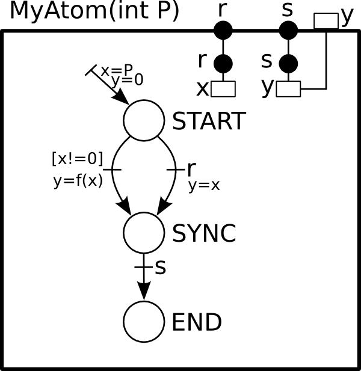

.. _language-label:

The BIP2 Language
=================

Introduction
------------

.. index::
   single: atom type
   single: compound type
   single: connector type
   single: port type
   single: atom
   single: compound
   single: connector
   single: port
   single: component
   single: interface
   single: component; interface
   single: priorities
   single: package
   single: model
   single: automaton
   single: Petri net

   The three-layered BIP2 representation.

BIP2 (*Behavior, Interaction, Priority* version 2) is a component-based language
for modeling and programming complex systems. In BIP2, a system is represented
by:

* the *behavior* specified by a set of *components*
* a set of *interactions* which defines the possible synchronizations and
  communications between the components; they are structured in *connectors*
  that corresponds to subset of interactions (see
  :ref:`language-connector-label`)
* a set of *priorities*  used for resolving conflicts between
  interactions or for defining interaction schedule policies
  (see :ref:`language-priorities-label`).

With behavior, interactions and priorities we can build hierarchies of complex components
called *compound* components or *compounds* for short.
A compound component is composed of  a set of components,
connectors and priorities (see :ref:`language-compound-label`).
*Atomic* components, or *atoms* for short, are the simplest component type (*i.e.* non
hierarchical) whose behavior is expressed by *automata* or *Petri nets*
(see :ref:`language-atom-label`).

In the following, we use the term *component* to refer to either an *atomic* or
a *compound* component. The *ports* and *variables* accessible to other
components and connectors define the component interface. Ports are used for
component communication in a synchronized manner.  Variables store information
accessible to priority and transition guard expressions to resolve conflicts and
non-determinism.

The BIP2 compiler processes an input file that contains a *package*
declaration. In the processed file, a compound component, called *model*,
describes the system we want to simulate, analyze, verify or just execute.

Quick overview of the language
------------------------------

.. Introduction
.. ^^^^^^^^^^^^

Preliminary notations
^^^^^^^^^^^^^^^^^^^^^

In the following sections we describe the *main* features of the BIP2 language.
The language syntax is expressed by a set of derivation rules that observe the
following conventions:

* a rule begins with a name followed by the symbol '``:=``' and one or more
  terminal and non-terminal rules, *e.g.*: ``non_term := 'term' sub_non_term``
* terminal elements are enclosed in '``'``', *e.g.*: ``'terminal'``

Identifiers are used in many contexts to denote package names
(``package_name``), variables (``variable_name``) etc.  In reality, those
constructs are expressed by one rule in the grammar, but for readability we
refer to them with a descriptive rule synonym. You can find the full grammar in
:ref:`bip2-grammar-label`.

Examples of rules
"""""""""""""""""
::

  sample_rule :=
    'some text' another_rule 'some ending text'

  another_rule :=
    'foo bar terminal'

Annotations
^^^^^^^^^^^

Annotations offer a mechanism for defining information that are used by tools
other then the compiler. The compiler examines the syntax of annotation
directives but their content is ignored. BIP2 statements that accept annotations
are noted by the following notation:

* **accepts annotations**

The syntax for the annotations is given below.

Syntax
""""""
::

  annotation :=
    '@' annotation_name ['(' annotation_parameter (',' annotation_parameter)* ')']

  annotation_parameter :=
      annotation_key 
    | annotation_key '=' annotation_value 
    | annotation_key '=' '"' annotation_string_value '"'

Example
"""""""

::

  @cpp(foo=bar, obj="foo.o,bar.o")
  atom type MyAtom(int x)
   ...
  end

.. _language-package-label:

Packages
^^^^^^^^

.. index::
   single: package
   single: syntax; package
   single: external type
   single: atom type
   single: connector type
   single: compound type

A package is a unit of compilation contained in a single file. It may include
other *packages* with the ``use`` directive. In BIP2, a package may contain:

* constant data (see :ref:`language-data-label`)
* external data types (see :ref:`language-data-label`)
* external functions (see :ref:`language-data-label`)
* external operators (see :ref:`language-actions-label`)
* port types (see :ref:`language-port-label`)
* atom types (see :ref:`language-atom-label`)
* connector types (see :ref:`language-connector-label`)
* compound types (see :ref:`language-compound-label`)

..
   Refine the following paragraph

Constants are referenced in type definitions or in the initialization of other
constant data. Constant data are visible only within the package that defines
them.

.. IMPORTANT::

   BIP2 permits the declaration of type *names* used for simple type checking
   but doesn't support type definitions (classes, structures, etc.).
   It's the responsibility of the back-ends to really interpret the types (for
   example, the C++ back-end will map these types to C++ types directly).

.. IMPORTANT::
   To refer to types declared in other packages, prefix the type name with the
   name of the package where it is declared (e.g. some.pack.name.SomeAtomType)
 

Syntax
""""""

* **accepts annotations**

::

  package_definition :=
    'package' package_name
       ('use' package_name)*
     
       data_type*
       (extern_function | extern_operator)*
       bip_type+
    'end'
  
  data_type :=
   'extern data type' type_name
       [ 'refine' type_name (',' type_name)* ]
       [ 'as' '"' backend_name '"' ]

  extern_function :=
   'extern function' [type_name] function_name '(' [ type_name (',' type_name)* ] ')'

  extern_operator :=
   'extern oprator' [type_name] operator '(' [ type_name (',' type_name)* ] ')'

Example
"""""""

::

  package SomePackage
    const data int my_const_int = 42

    extern data type my_list

    extern function int min(int, int)
    extern function printf(string)
    extern function display(my_list)
    extern function int get(int i, my_list)

    port type Port_t()
    port type Port_t2(int i, my_list l)
  end

.. _language-data-label:

Variables and data types
^^^^^^^^^^^^^^^^^^^^^^^^

.. index::
   single: type; variable
   single: variable
   single: variable; type
   single: variable; type; native
   single: variable; type; external

In BIP2, variables are used to store data values. Their declaration consists of
a (data) type and a name. For example::

  data int x

declares a variable named ``x`` of type ``int``. The keyword ``data`` is ommited
in the declaration of parameters of BIP2 types (i.e. port types, atom types,
connector types, and compound types). Constant variables can also be declared in
packages using the keyword ``const data`` and the initialization operator ``=``.
For example::

  const data float Pi = 3.1415926

at the beginning of a package declares a constant named ``Pi`` of type ``float``
with value ``3.1415926``.

.. IMPORTANT::
   The constant variables of packages are the only ones that can (and must) be
   initialized when declared. Other types of variables should be initialized
   after their declaration.

Types of variables are either *native* or *external*. Native types are known to
the BIP2 compiler and are part of the language. Currently, the supported native
types are:

  * ``bool`` for boolean values ``false`` and ``true``
  * ``int`` for integers (e.g. ``-100``, ``0``, ``32``)
  * ``float`` for floating-point numbers (e.g. ``2.7182818``)
  * ``string`` for sequences of characters (e.g. ``"My name is BIP2\n"``).

Notice that the type ``int`` is considered by the compiler as a sub-type of
``float`` regarding compatibility of types, which means each time the type
``float`` is accepted, the type ``int`` is also accepted.

.. IMPORTANT::
   The exact encoding (number of bits, range) of the native data types is not
   specified by the semantics of BIP2. Currently, the specialization is done in
   the *back-ends*. Typically, native data types are mapped to the usual
   types of the target language, e.g. when using the C++ back-end the native
   types of ``bool``, ``int``, ``float``, and ``string`` are mapped respectively
   to the C++ types ``bool``, ``int``, ``double``, and ``std::string``.

   Notice that constant variables of packages, as well as parameters of
   components, can be only of a native type.

Besides the predefined native types, additional types can be declared with the
keyword ``extern``. These types are supposed to be externally defined and
present when compiling the generated code. For instance, when using the C++
backend all the external types should be defined in additional C++ files
included in the compilation process of the generated code. An example of
declaration of an external type named ``IntList`` can be found below.
::

  extern data type IntList refine List as "std::list<int>"

This declaration states that ``IntList`` is a valid type name.
It also specifies that ``IntList`` is a sub-type of the (external) type
``List``, and that ``IntList`` should be translated into ``std::list<int>`` by
code generators (e.g. in this example we target C++ code generation). Code
generators use the name of the type (in this example ``IntList``) if the
instruction ``as`` is not provided, e.g. when using the following declaration
code generators will not translate ``IntList`` and use its name directly in the
generated code.
::

  extern data type IntList refine List 

.. IMPORTANT::
   Without any additional declation, the compiler assumes that no operation
   can be performed on external types except assignments (using ``=``). This
   means that assignments of external types should be implemented in the
   generated code, e.g. by additional files included in the compilation process.

As for external types, BIP2 allows the declaration of external function
prototypes that are assumed to be externally defined and present when compiling
the generated code. The declaration of an external function consists of an
optional return type name, a function name, and a list of types names for the
arguments of the function. For example::

  extern function int rand()
  extern function printf(string)
  extern function int getElement(int, IntList)

declares prototypes for:

* the external function ``rand`` having no argument and returning an ``int``
* the external function ``printf`` that takes a ``string`` as argument and have
  no returned value
* the external function ``getElement`` that takes an ``int`` and an ``IntList``
  as arguments, and returns an ``int``. 

.. IMPORTANT::
   External function prototypes may involved external data types (that must be
   declared properly obviously). There are no specific restrictions in the
   declaration of prototypes concerning overloading: different prototypes may
   have the same function name even if they have the same number of arguments
   and/or different return types. This may trigger errors when compiling
   expressions involving calls to external functions, as explained in
   :ref:`language-actions-label`.

.. _language-actions-label:

Actions
^^^^^^^

*Actions* define computations and data transformations. In the *constant*
context, expressions should not have side effects. Notice that the compiler
is unable to check whether an external function involved in a constant context
has side effects. It is the user's responsibility to ensure the absence of side
effects in such context. In the *non-constant* context any computation is
allowed. There are also *mixed* contexts where some data can be changed while
others can't (see :ref:`language-connector-label`). Whenever possible, the
compiler will restrict the possible actions to enforce the "const-ness".

.. index::
   pair: action language; constant context
   single: action language; non-constant context

Computations and data transformations in actions are expressed by C-like syntax
statements and expressions. Statements are assignments, function calls and
conditional ``if``-``then``-``else`` constructs. Notice that the language has no
support for loops. Expressions involved in statements can combine values using
comparison operators, arithmetics operators, boolean operators, and function
calls (with returned values). As usual, parenthesis ``(`` and ``)`` may be used
to group expressions and enforce a specific evaluation order. Multiple
statements in an action are enclosed in brackets while individual statements are
separated by ``;``. The following operators can be used for native types.

Comparison operators can be used to compare two values of the same native type
and return a value of type ``bool``. In addition we also allow the comparison of
``int`` to ``float`` and ``float`` to ``int``. The list of comparison operators
is provided as follows.

* ``==`` : equality
* ``!=`` : inequality
* ``<``  : *less than*
* ``>``  : *greater than*
* ``<=`` : *less or equal than*
* ``>=`` : *greater or equal than*

Arithmetic operators provided below can only be applied to numbers, i.e. ``int``
and ``float`` data types. They return a value of type ``int`` if all the
arguments are of type ``int``. They return a value of type ``float``
otherwise.

* ``/`` : *division*
* ``%`` : *modulo*
* ``+`` : *addition* or  *positive sign*
* ``-`` : *subtraction* or *negative sign*
* ``*`` : *multiplication*

Logical boolean operators apply to boolean values only (of type ``bool``), and
return boolean values:

* ``&&`` : logical *and*
* ``||`` : logical *or*

Boolean bitwise operators apply to ``int`` only, and return ``int``:

* ``&``  : bitwise *and*
* ``|``  : bitwise *or*
* ``^``  : bitwise *exclusive or*
* ``~``  : bitwise *not*
* ``!``  : logical *not*

The assignment operator may assign a value to a variable provided that the type
of this value is compatible with the type of the variable, that is, if it is of
the same type or if it is of a sub-type. Notice that in contrast to previous
operators, by default the assignment operator applies also to external types.

* ``=`` : assignment

.. IMPORTANT::
   The exact behavior data types and corresponding operations is not
   specified by the semantics (*e.g.* min/max ranges of integer and
   floating point types, behavior of overflows, etc.). Currently, the
   specialization is done in the *back-ends* (usually by mapping
   directly BIP2 types and operations to usual types and operations of
   the target language).

In addition to the predefined operators, external functions can be call provided
their prototype is declared, as explained in :ref:`language-data-label`. We say
that a function call matches a prototype if it has the same function name and
the same number of arguments, and if its arguments are compatible with the ones
of the prototype.
We say that a prototype is strictly more precise than another prototype if it
has compatible arguments with at least one being a strict sub-type. For example
in the following the first prototype is strictly more precise than the third
prototype, whereas it is not comparable with the second prototype::

  extern function float min(float, int)
  extern function float min(int,   float)
  extern function int   min(int,   int)
 
A function call will not compile if one of the following assertions apply:

* it does not match any declared external function prototype ("no match
  prototype" error)
* it matches at least two prototypes without one beging strictly more precise
  than the other one ("ambiguous function call" error)
* the return type of the most precise matching prototype is not compatible with
  the rest of the expression in which the function is called ("incorrect type"
  error)
* the most precise matching prototype has no return type and the function call
  is involved in an expression ("no return value" error).

Considering that the prototypes for ``min`` are restricted to the following::

  extern function float min(float, int)
  extern function float min(int,   float)

then the statement ``x = min(0, 0);`` will lead to a compilation error such as::

  [SEVERE] In /path/to/file/my_bip_file.bip:
  Ambiguous function call 'min' with parameter(s) of type(s) 'int, int': cannot decide
  between 'float min(float, int), float min(int, float)' :
      38:
      39:         x = min(0, 0);
  --------------------^
      40:
      41:

Similarly to external functions, external operators can be declared by using
``extern operator`` followed a return type, the target operator (instead
of the function name) and its arguments, e.g.::

  extern operator string +(string, string)

These declarations should always include a return type, and are limited to the
number of arguments a given operator has in the language for native types. For
example, in the following code the first two declarations are not permitted
whereas the last two ones are accepted::

  extern operator Complex *(Complex)           // not valid: missing argument    - ERROR!
  extern operator         *(Complex, Complex)  // not valid: missing return type - ERROR!
  extern operator Complex *(Complex, Complex)  // OK
  extern operator Complex *(float,   Complex)  // OK

Notice that declarations of external comparison operators (``==``, ``!=``,
``<``, ``>``, ``<=``, ``>=``) are not forced to return boolean values, but for
readability of the code we recommend to avoid such practice. Similarly, logical
operators (``!``, ``||``, ``&&``) may be redefined for non boolean values, but
again we strongly recommend not doing it::

  extern operator int     ==(IntList, IntList)  // allowed but not recommended!
  extern operator IntList ||(IntList, IntList)  // allowed but not recommended!

.. index::
   pair: action language; operators
   pair: action language; function call

Example
"""""""
::

  {
    a = a * (2 + b);
    g(d);
    b = f(a);
  }

In a constant context, an action contains a single expressions enclosed in
parenthesis that must evaluate to a boolean value.

.. IMPORTANT::
   Depending on the locations of the actions, the data reference can take
   different forms. For example, in :ref:`language-atom-label`, the data can be
   directly referenced by its declaration name whereas a connector action
   referencing a data within a port must use a dotted notation (*e.g.*
   ``port_name.data_name``).

.. index::
   pair: action language; if

There is currently only one control flow operation: ``if``-``then``-``else``
with the following syntax::

  if ( boolean_condition ) then
    statement1;
  else
    statement2;
  fi

The ``else`` part is optional and may be omitted. The expression
``boolean_condition`` must evaluate to a boolean value.

.. _language-port-label:

Port types
^^^^^^^^^^

.. index::
   single: port
   single: port; type

*Ports* are used to synchronize component and convey information in a
synchronized manner between the components of a model. The transferred
information is accessible via the variables associated with the port.
Port types are declared with the ``port type`` keyword followed by the
port type name and a possibly empty list of accessible variables. The
following example declares a port with type ``port_t`` which can access
integer values from the ``x`` variable::

  port type port_t(int x)

Syntax
""""""

* **accepts annotations**

::

  port_type_definition :=
    'port type' (package_name '.')? port_type_name
      '(' data_param_declaration (',' data_param_declaration)* ')'

.. _language-atom-label:

Atoms
^^^^^

.. index::
   single: atom
   pair: atom; type

*Atoms* are the simplest components with a behavior described by an automaton or
a Petri net extended with data. An *atom type* is declared with the ``atom
type`` directive which contains:

* a possibly empty list of variables for storing data. Data declarations may be
  *exported* to become accessible to priorities.
* an optional list of port declarations that may reference variables. Exported
  ports are accessible to connectors.
* an automaton or a Petri net that defines the behavior of the atom. The
  behavior is described by a set of transitions that change the state of the
  atom in reaction to enabled ports.

Data types and variables
""""""""""""""""""""""""

.. index::
   single: variable
   single: variable; exported

In BIP2, (data) variables are used to store data. A declaration of a variable is
 ``data`` keyword. For example::

  data int x

declares an integer variable named ``x``.

Variables exported with the
``export`` directive can be used in guards of compound component priorities (see
:ref:`language-compound-label`).

Ports
"""""

.. index::
   single: port
   single: port; internal
   single: port; exported
   single: port; merged export

Atoms have ports declared with the ``port`` directive that consists of a type, a
name and an optional list of previously declared variables. It is an error if
the types of the previously declared variables do not match the type of the
corresponding port parameters. Implicit type casting is not permitted. For
example, if a previously declared parameter is of type ``float``, a port
parameter of type ``int`` is not allowed. In the following code excerpt, three
variables named ``a``, ``b`` and ``c`` are associated with the three parameters
of the port with type ``Port_t``::

  port type Port_t(int x, float y, some_type z)

  atom type SomeType()
    data int a
    data float b
    data some_type c

    port Port_t p(a, b, c)
    ...
  end

Ports can be exported with the ``export`` directive and become accessible to
other model components. Exported ports can be accessed individually in the
component interface (see Figure 2.2) or merged into one port (see Figure
2.3). In the later case, they must accept the same number and types of
parameters. The merged port provides access to all variables of the individual
ports.

   Ports ``p``, ``q`` and ``r`` are individually exported.

In BIP2, ports ``p``, ``q`` and ``r`` are individually exported using the
following statement::

    export port port_t p(x), q(y), r(z)

   Ports ``p``, ``q`` and ``r`` are merged and exported as the port ``exp``.

To merge and export ports ``p``, ``q`` and ``r`` as a single port ``exp`` we use
the keyword ``as``::

    export port port_t p(x), q(y), r(z) as exp

.. _language_petri_nets_label:

Petri net
"""""""""

.. index::
   single: guard
   single: marking
   single: place
   single: non-determinism
   single: Petri net
   single: Petri net; transition
   single: Petri net; place
   single: Petri net; marking
   single: Petri net; 1-safe
   single: transition
   single: transition; enabled
   single: transition; internal
   single: transition; initial
   single: transition; visible
   single: transition; invisible
   single: transition; guard

*Petri nets* implement the behavior of atoms. They consist of *places* and
*transitions*. Places are used to store the current control location of the atom
given by a *marking* of the places, that is, a boolean function associating true
to the marked places. Places are declared in an atom using the keyword
``places`` followed by a list of place names, *e.g.* the following code declares
the places named ``START``, ``SYNC`` and ``END``::

  places START, SYNC, END

Transitions change the current *state* of an atom and invoke associated actions
that may alter the values of atom variables. A transition specifies:

* The set of *triggering* places that are required to be all marked at the
  current state for the transition to occur. They are declared using the keyword
  ``from``.
* The set of *target* places that are marked after its execution. They are
  declared using the keyword ``to``.
* A boolean condition on values of (local) variables that must be fulfilled at
  the current state for the transition to occur. This condition, called *guard*,
  is declared using the keyword ``provided``. If no expression is provided, the
  guard places no restrictions on the transition.
* An optional block of code after the ``do`` keyword that is evaluated when the
  transition occurs.

A transition of an atom is *enabled* if:

* it is enabled by the marking, that is, all its triggering places are marked at
  the current state and
* the associated guard evaluates to true or there is no guard associated with
  the transition.

.. index::
   single: automaton

..
  Question: What does marking a state mean?

.. IMPORTANT::
   
   Notice that in BIP2 we target *1-safe* Petri nets where the target places of
   an enabled transition are never marked. This property for a Petri net of an
   atom is checked both at compile time and at run time, and leads to an error
   if violated. Notice that since *automata* are a sub-case of 1-safe Petri
   nets, they can be used to define the behavior of atoms. In *automata*, each
   transition has at most one triggering place and one target place.

We distinguish three types of transitions:

* The *initial* transition is responsible for initializing the marked places and
  atom variables. It is a mandatory transition executed once during the model
  initialization.  It has no triggering places and no associated
  guard. Moreover, the initial transition can not be observed by other
  components nor synchronized with their transitions.  For example, the
  following code fragment specifies the initial transition of an atom that marks
  the place ``START`` and initializes the variables ``x`` and ``y``::

    initial to START do { x=0; y=0; }

* *Internal* transitions are invisible to other components and take precedence
  over other observable transitions. Their execution depends on the current
  state and associated guards. Internal transitions are declared using the
  keyword ``internal``, *e.g.* the following specifies an internal transition
  enabled in the ``START`` place that sets the current state to the ``SYNC``
  place restricted by an associated guard::

    internal from START to SYNC provided (x!=0) do { x=f(); }

* Transitions *labeled by internal port* names are visible to other
  components. A transition labeled by an internal port that is exported can be
  synchronized with transitions of other components using connectors (see
  :ref:`_language-connector-label`). Such transitions are declared in atoms
  using the keyword ``on``,
  *e.g.* the following specifies a transition labeled by the internal port
  ``s``, that changes the current state from ``SYNC`` to ``END``::

    on s from SYNC to END

.. index::
   single: visible state

The following figure gives an example of execution sequence of transitions in an
atom ``A`` in which the initial transition is followed by the execution of an
internal transition, then a transition labeled by port ``p`` is executed
followed by the execution of two internal transitions, and finally a transition
labeled by port ``q`` is executed leading to a state in which no transition is
enabled. Notice that the only visible states of ``A`` are the ones preceding the
executions of ``p`` and ``q`` and the final state, the other intermediate states
are invisible.

   Sequence of internal and visible transitions in an atom.

.. index::
   single: Petri net; non-determinism
   single: non-determinism

.. IMPORTANT::

   Only one internal transition is enabled at any time since non-determinism is
   not allowed for internal transitions of atoms. Similarly, two transitions
   labeled by the same internal port name must not be enabled at the same time.

Priorities
""""""""""

.. index::
   single: priority
   pair:   priority; atom
   single: priority; cycle
   single: priority; rule
   single: transitive closure
   single: transition; maximal
   single: guard

*Priorities* are used to resolve conflicts or to define an ordering between
transitions labelled by ports: the selected transition corresponds to the port
with highest priority. They may also include a boolean expression called *guard*
that specifies the conditions when it is applicable. Priorities do not apply to
the initial and internal transitions.
In the following example, port ``q`` has higher priority than ``p`` provided that
variable ``x`` equals to zero.::

  priority myPrio p < q  provided (x==0)

The transitive closure of such priorities defined in an atom is a partial order
relationship among ports and associated transitions. A port ``q`` has higher
priority than ``p`` if there is a priority rule specifying ``p < q`` whose guard
evaluates to true, or there are ports ``p1``, ``p2``, ..., ``pN`` such as
``p < p1 < p2 < ... < pN < q`` such that all their corresponding guards evaluates
to true.
Notice that it is not required for ports ``p1`` to ``pN`` to be enabled. An
enabled transition is *maximal* if it has the highest priority.

.. IMPORTANT::

   Inconsistencies in priorities (e.g. ``a < b < c < a``) are detected and
   reported. If the priorities do not include guards, the checks are performed
   at compile time. Guard expressions can not be evaluated during the model
   compilation so in this case priority validation is postponed until run time.

.. _atom-enabled-ports-label:

Enabled ports of atoms
""""""""""""""""""""""

.. index::
   single: port; enabled

An internal port is *enabled* if it triggers an enabled transition for the
current atom state. The port is *maximal* if its corresponding enabled
transition is maximal. An exported maximal port is also enabled at the interface
level. When several maximal internal ports are exported through the same port
(i.e.  merged export), they are all visible to other components that can
interact with any of the internal ports through the interface. Consequently, if
an internal port references variables, the values accessible from the interface
are the values of the enabled maximal internal ports.

The following figure illustrates an example of a merged port named ``exp`` that
consists of three internal ports ``p``, ``q`` and ``r`` and each internal port
references a variable (e.g. ``x``, ``y`` and ``z``). Port ``exp`` is enabled if
at least one of the corresponding ports is enabled. However, only the variables
of the enabled internal ports are accessible from the interface. For example, if
ports ``x`` and ``z`` are enabled, the associated ``u`` and ``w`` values are
accessible from ``exp``. On the other hand, if only port ``y`` is enabled, the
value associated with port ``exp`` is ``v``. This means that when other
components interact with ``A`` through port ``exp``, depending on which of the
internal ports is enabled, they interact with port ``p`` using value ``u``, or
with port ``q`` using value ``v``, or with port ``r`` using value ``w``.

   Example of a port enabled by an atom and the corresponding values of its
   variable.

Example
"""""""

::

  atom type MyAtom(int P)
           data int x
    export data int y

           port Port_t r(x), s(y)

    places START, SYNC, END

    initial             to START                do { x=P; y=0; }
    internal from START to SYNC provided (x!=0) do { y=f(x); }
    on r     from START to SYNC                 do { y=x; }
    on s     from SYNC  to END
  end

The above block of BIP2 code gives an example of atom type ``MyAtom`` that
accepts one integer parameter ``P``, and consists of two integer variables ``x``
and the exported variable ``y`` and two exported ports ``r`` and ``s``. Three
places, ``START``, ``SYNC``, ``END``, are the states of the automaton that
defines the behavior of the atomic component. An initial transition leads to
``START``, an internal transition changes the state from ``START`` to ``SYNC``,
an other transition triggered by ``r`` does the same and finally a transition
triggered by ``s`` modifies the state from ``SYNC`` to ``END``. A graphical
representation of ``MyAtom`` is provided below.

Since internal transitions have higher priority than port transitions, the
transition of port ``r`` is executed only if the guard of the internal
transition does not hold, i.e. the value of variable ``x`` is zero.

Syntax
""""""

* **accepts annotations**

::

  atom_type_definition :=
    'atom type' atom_type_name '(' [ data_parameter (',' data_parameter)* ] ')'
       (['export'] 'data' data_type 
          data_declaration_name ( ',' data_declaration_name )* )*
       (['export'] 'port' port_type
          port_name '(' data_declaration_name (',' data_declaration_name )*) ')'
          ( ',' port_name '(' data_declaration_name (',' data_declaration_name )*) ')' )*
          ['as' port_name] )*
       'place' place_name (',' place_name)*
       'initial to' place_name (',' place_name)* ['do' actions]
       ( ('on' port_name | 'internal') 
          'from' place_name (',' place_name)* 
          'to' place_name (',' place_name)*
          ['provided' '(' transition_guard ')'] )*
          ['do' actions]
       atom_priority_declaration*
     'end'
    

.. _language-connector-label:

Connectors
^^^^^^^^^^

.. index::
   single: connector
   single: connector; interaction
   single: connector; trigger
   single: connector; synchron
   single: connector; exported port
   single: connector; hierarchical
   pair:   type; connector
   single: port; synchron
   single: port; trigger
   single: interaction

Connectors are *stateless* entities that enable interactions among a set of
components via their interface ports. Interactions defined by a connector are
strong synchronizations (*i.e.* a rendez-vous) of a subset of the connected
components. Interactions may also include data that are transferred between the
components. A connector is *hierarchical* if it connects ports exported by other
connectors.

Connected ports
"""""""""""""""

A connector type accepts a list of typed ports that correspond to the ports of
the entities it connects (components or other connectors). Connectors (*i.e.*
instances of connector types) bind these parameters to actual ports of the same
type.

.. IMPORTANT::
  Components or connectors must be connected at most once in a connector, that
  is, a component or a connector must not be reachable from different connected
  ports.

Data variables
""""""""""""""

Connector types can define variables that are used for storing intermediate
results of computations performed in transfer functions associated with
interactions. The temporary stored value is accessible only during the
associated interaction. The syntax is shown in the following example where we
declare an integer variable named ``tmp``::

  data int tmp

Exported port
"""""""""""""

.. index::
   single: connector; top-level

A connector may *export* a single port that can be connected to other connector
instances and form *hierarchical* connectors, or it can be exported in the
interface of *compound* components (see :ref:`language-compound-label`). A
connector is *top-level* if the exported port is not connected directly to 
another connector (i.e. it can be connected to other connectors only at upper
levels after being exported by the containing compound), or if it has no
exported port. An exported port named ``exp`` of type ``port_t``, referencing a
variable ``tmp``, is declared in a connector type as follows::

  export port port_t exp(tmp)

Defined interactions
""""""""""""""""""""
Formally, an interaction of a connector type is a subset of its ports.
A connector type explicitly define a set of permitted interactions regardless of
the status of the connected ports. The interactions are defined in terms of
expressions involving port names, according to the following grammar::
  connector_port_expression :=
    ( sub_expression )+

  sub_expression :=
    ( port_name | '(' connector_port_expression ')' ) [''']

That is, an expression is a list of either port names or nested expressions
(expressions enclosed into parenthesis) that can be optionally quoted. Quoted
port names or nested expressions are called *triggers*, whereas unquoted ones
are *synchrons*.

An expression of the form ``p``, where ``p`` is a port name, defines a single
interaction  '``p``'.
Interactions defined by an expression of the form ``e'`` are the ones defined
by ``e``. Interactions defined by an expression of the form ``e1 e2...eN`` are
computed recursively from the interactions defined by sub-expressions ``e1``,
``e2``, ..., ``eN``, as explained as follows. An interaction is defined by
``e1 e2...eN`` if both following rules apply:

* it can be written as a union of interactions defined by sub-expressions ``e1``,
  ``e2``, ..., ``eN``
* it contains (at least) an interaction defined by a trigger sub-expression, or
  for each sub-expression ``eI``, ``I=0,...,N``, it contains an interaction
  defined by ``eI``.

In the following example we define one trigger sub-expression ``(p q)``, and two
synchrons ports ``r`` and ``s``::
  define (p q)' r s
Interactions permitted by such an expression
are the ones containing (at least) both ports ``p`` and ``q``, i.e. '``p,q``', '``p,q,r``',
'``p,q,s``' and '``p,q,r,s``'.

Guards and transfer functions
"""""""""""""""""""""""""""""
.. index::
   single: guard
   single: interaction; guard

The set of defined interactions in a connector type can be further restricted by
*guards*. Guards evaluate a boolean expression that refers to variables of the
ports involved in an interaction. The associated interaction is enabled only if
the guard evaluates to true.

*Transfer functions* are used for exchanging data between the components that
participate in an interaction. They consist of two instruction groups, the
``up`` and the ``down`` group.

The ``up`` instructions compute the values of the variables referenced by
exported ports. Also, intermediate values used in computations in the ``down``
section may be temporary stored in the connector's variables. In the following
example we define a rendez-vous interaction between two ports where a temporary
value is stored in the ``tmp`` variable. To prevent division by zero, the
interaction is disabled when the value of the ``y`` variable equals 0::

    on p q provided (q.y != 0) up { tmp = p.x / q.y; }

The ``down`` instructions may update the values of the variables associated with
the ports involved in an interaction. Port variables are assigned with values
computed from connector variables and variables of the exported port. In the
following example, the instructions swap the values of variables ``x`` and ``y``
of ports ``p`` and ``q``::

    on p q down { tmp = p.x; p.x = q.y; q.y = tmp; }

Notice that transfer functions ``up`` and ``down`` can be simultaneously defined
for a connector interaction. ``up`` functions correspond to data moving upwards
in the connector and component hierarchy, that is, from values of variables of
the connected ports to the values of variables of the port exported by a
connector. Once an interaction is chosen and executed, ``down`` functions
correspond to the downward flow of data, that is, from variables of the exported
port to variables of the connected ports.

.. IMPORTANT::

   For a given interaction, the temporary values of connector variables when
   executing the ``down`` instructions are computed by the corresponding ``up``
   instructions. However, these values are not accessible between different
   executions of the same interaction or between the execution of the transfer
   functions of different interactions. They are only stored between the
   execution of ``up`` and ``down`` instructions of the same interaction.

Example
"""""""

::

  connector type ConnectT(Port_t1 p, Port_t2 q, Port_t3 r)
    data int tmp
    export port Port_t exp(tmp)

    define p' q r

    on p     up { tmp = p.x; }                down { p.x = tmp; }
    on p q   up { tmp = max(p.x, q.y); }      down { p.x = tmp; q.y = tmp; }
    on p r   up { tmp = max(p.x, r.z); }      down { p.x = tmp; r.z = tmp; }
    on p q r up { tmp = max(p.x, p.x, r.z); } down { p.x = tmp; q.y = tmp; r.z = tmp; }
  end

In the previous BIP2 code excerpt we provided a complete definition of a
connector type named ``ConnectT`` that connects three ports ``p``, ``q`` and
``r``. We have already seen in previous examples the enabled interactions and
the computations performed by the transfer functions. A noticeable difference is
that variable ``tmp`` is accessible to other connectors that interact with port
``exp``. Hence, the value of ``tmp`` may differ from the computation performed
by ``up`` since it may be altered by the transfer functions of connectors
connected to ``exp``.  A simplified graphical representation of ``ConnectT`` is
provided below.

   
   Connector type example

Enabled interactions and ports exported by connectors
"""""""""""""""""""""""""""""""""""""""""""""""""""""

.. index::
   single: port; enabled
   single: interaction; enabled

The set of ports defined by an interaction is restricted at run time based on
the status of the involved ports and the evaluated guards. Let us consider an
example of interaction involving ports ``p``, ``q`` and ``r``::

  define p' q r

Based on the definition above, the permitted interactions are ('``p``', '``p,q``',
'``p,r``' and '``p,q,r``'). To determine which of the combinations are valid in a
model execution, we first remove all combinations that contain a disabled port
and then we evaluate the associated guards to further restrict the possible
combinations.

An exported port of a connector is *enabled* if there is at least one enabled
interaction. Notice that the value visible at the interface through the exported
port is derived by the set of values of ports participating in an interaction.
The values accessible from an enabled interaction are in turn computed by the
instructions of the ``up`` transfer function.

The notions of enabled interactions and corresponding values of the variables of
exported ports of connectors are illustrated by the following example. Consider
an instance ``C`` of the connector type ``ConnectT`` presented above. Assume
that ports ``p``, ``q``, ``r`` are enabled, and that variable ``x`` of port
``p`` has three possible values ``u1``, ``u2``, ``u3``, variable ``y`` of port
``q`` has three possible values ``v1``, ``v2``, ``v3``, and variable ``z`` of
port ``r`` has only a single value ``w``. Then, interactions '``p``', '``p,q``',
'``p,r``' and '``p,q,r``' are enabled. Moreover, there are 24 possible values
for variable ``tmp`` of the exported port ``exp``, corresponding to the
application of ``up`` to all combinations of values for the 4 enabled
interactions:

* The values corresponding to interaction ``p`` are the values of ``x``, that
  is, ``u1``, ``u2`` and ``u3``.
* The values corresponding to  interaction ``p,q`` are ``oIJ- = max(uI, vJ)``,
  such that ``I=1,2,3`` and ``J=1,2,3``.
* The values corresponding to interaction ``p,r`` are ``oI-* = max(uI, w)``,
  such that ``I=1,2,3``.
* The values corresponding to interaction ``p,q,r`` are
  ``oIJ* = max(uI, vJ, w)``, such that ``I=1,2,3`` and ``J=1,2,3``.

   Enabled interaction of a connector and the corresponding values of variable
   ``tmp``.

Syntax
""""""

.. index::
   single: syntax; connector type

* **accepts annotations**

::

  connector_type_definition :=
    'connector type' connector_type_name '(' port_parameter (',' port_parameter )* ')'
      ('data' data_type data_declaration_name ( ',' data_declaration_name )* )*
      ['export port' port_type 
         port_name '(' data_param_declaration (',' data_param_declaration)* ')' ]
      'define' connector_port_expression
      connector_interaction*
    'end'

  connector_interaction :=
    'on' (port_name)+
    ['provided' '(' connector_guard ')']
    ['up' '{' (statement ';')+ '}']
    ['down' '{' (statement ';')+ '}']

  connector_port_expression :=
    ( port_name ['''] | '(' connector_port_expression ')' ['''] )+

  (a connector interaction must have at least one of 'up', 'down' or 'provided')

.. _language-compound-label:

Compounds
^^^^^^^^^

.. index::
   pair: compound; type

Compounds are composite components constructed by atomic components and other
compound components. Just like atomic components, compounds provide a set of
ports at the interface level. In this sense, components are used in the same way
regardless of their structure (compounds or atomic). A compound type defines the
following.

* a set of components, either atomic or compound, declared with the keyword ``component``.

* a set of connectors declared with the keyword ``connector`` that connect the
  contained components.

* a set of *priority rules* declared with the keyword ``priority``.

* a set of exported ports that define the interface of the compound declared
   with the keyword ``export``.

Notice that a compound component can export ports of contained components as
well as ports of connectors.

.. _language-priorities-label:

Priorities
""""""""""

.. index::
   single: maximal progress
   single: priorities
   single: compound; priorities
   single: priority; compound
   single: priority; rule
   single: priority; maximal progress
   single: priority; ``*``

*Priorities* are used to favor the execution of a subset of enabled interactions
called the *maximal* interactions (see below for a definition of maximal
interactions). They can be used to resolve conflict between interactions or to
express particular scheduling policies.

Priorities of a compound, form a partial order relationship that corresponds to
the transitive closure of the defined priority rules. One set of priority rules
is automatically derived based on the *maximal progress* principle,
i.e. interactions that involve more connectors have higher priority.

 ..
    For example::

       C:A1.p1,...,AN.pN < C:A1.p1,...,AN.pN,AN+1,...,AM.pM

     where ``C`` is a connector, and ``A1.p1,...,AN.pN`` and

       ``A1.p1,...,AN.pN,AN+1,...,AM.pM`` are interactions defined in ``C``, and
      * *user-defined* rules declared with the ``priority`` keyword as explained
        below.

User-defined priority rules are of the form ``I < J``, where ``I`` and ``J`` are
interactions of connectors expressed in one of the following forms:

* ``C:A1.p1,A2.p2,...,AN.pN`` where ``C`` is a connector and
  ``A1.p1,A2.p2,...,AN.pN`` is a subset of the connected ports that corresponds
  to a defined interaction of ``C``.
* ``C:*``, where ``C`` is a connector represents all the defined interactions of
  ``C``.
* ``*:*`` represents all the defined interactions for all connectors.

.. IMPORTANT::
   User-defined priority rules can only involve interactions of *top-level*
   connectors.

   The use of ``*`` in priority rules is a shortcut for sets of rules.  Notice
   that ``*:*`` cannot be used for both sides of a priority rule, (e.g.  ``*:* <
   *:*`` is not allowed). The use of ``*:*`` in one side of a priority rule is a
   shortcut for all interactions defined in all connectors except those involved
   in the other side of the rule.
   
User-defined priority rules may include guards declared with the ``provided``
keyword.  A rule is *enabled* only if its guard evaluates to true. In the
following code excerpt we show a priority rule named ``myPrio`` that is enabled
only if the values of the ``x`` and ``y`` variables of the atomic components
``A`` and ``B`` are not the same::

  compound type Compound_T()
    component Atom_T A()
    component Atom_T B()

    connector RDV C(A.p,B.p)
    connector RDV D(A.q,B.q)

    priority myPrio provided (A.x != B.x) C:A.p,B.p < D:A.q,B.q
  end

.. IMPORTANT::
   Since priorities define a partial order relationship between interactions,
   priority rules enabled at a state of a compound must not form a cycle.

An enabled interaction ``I`` of a connector ``C`` *has lower priority* than an
enabled interaction ``J`` of a connector ``D`` if ``D`` is reachable from ``I``
in the lattice of the defined priority rules, that is, if ``C:I < D:I`` is an
enabled rule or if there exists interactions ``C1:I1``, ..., ``CN:IN`` such that
rules ``C:I < C1:I1``, ``C1:I1 < C2:I2``, ..., ``CN-1:IN-1 < CN:IN``, ``CN:IN <
D:J`` are enabled. An interaction is *maximal* if it has the highest priority
among the enabled interactions.

Exported ports and variables
""""""""""""""""""""""""""""

.. index::
   single: port; enabled

Compound types export ports and variables in a similar fashion with atoms . The
following statement makes the ``x`` variable accessible from the interface of
the ``A`` component and renames it to ``y``::

  export port A.x as y

Ports of components and connectors can be exported individually or through a
single port using a merged export, in the same way as atoms. To determine if a
port of a compound component is enabled we check if the underlying port
(component or connector port) is enabled.  If a port of a component is enabled
and exported, then the corresponding port at the interface is enabled. If a
(maximal) interaction is enabled in a connector that exports its port to the
interface of a compound, then the interface port is enabled. Moreover, values
visible at the interface are the values corresponding to all its maximal
interactions. As for atoms, for merged exported ports the union of the values is
visible at the interface.

::

  compound type Compound_t()
    component Atom_t      A(), B()
    connector Connector_t C1(A.p, B.p)
    connector Connector_t C2(A.q, B.q)

    export port C1.exp, A.r, B.r as s

    priority myPrio C1:A.p,B.p < C2:*
  end

In the above example, the port ``s`` of an instance of the compound type
``Compound_t`` is enabled if the connector ``C1`` has a maximal interaction
(*i.e.* if no interaction is enabled by ``C2``), or if port ``r`` of ``A`` is
enabled, or if port ``r`` of ``B`` is enabled. Moreover, if these ports have
variables, the values visible from ``s`` are the union of the values
corresponding to the maximal interactions of ``C1`` and the values visible from
ports ``r`` of ``A`` and ``B``.

Example
"""""""

::

  compound type Compound_t()
    component CompT1 K1()
    component CompT2 K2()
    component CompT3 K3()

    connector BRDXP C(K1.p, K2.q)
    connector RDVXP D(C.xp, K3.t)
    connector RDV   E(K2.q, K3.s)

    export port C.xp as u
    export port F.xp as v
    export port K3.t as w

    export data K3.x as x
  end

The above example shows the syntax for defining a compound type ``Compound_t``
that consists of:

* the components ``K1``, ``K2`` and ``K3``
* the connectors ``C``, ``D`` and ``E``, such that ``C`` and ``D`` are connected
  and form a hierarchical connector
* the exported ports ``xp`` of ``C`` and ``F`` and the exported port ``t`` of
  ``K3``
* the exported variable ``x`` of ``K3``.

A graphical representation of the compound type is provided below. Notice that
all the enabled interactions of connector ``C`` are visible from connector ``D``
through the port ``xp`` of ``C``, *e.g.* if ``p`` and ``p,q`` are enabled, there
are both visible from ``D``. Since priorities are applied when exporting ports
to the interface of a compound, only maximal interactions of ``C`` are visible
from the interface port ``u`` though ``xp``, *e.g.* if interaction ``p`` and
``p,q`` are enabled, only ``p,q`` is visible from ``u`` due to the default
priority rule of maximal progress: ``p < p,q``. Notice also that a port can be
connected to several connectors (*e.g.* port ``q`` of ``K2``), or can be
exported and connected to connector(s) (*e.g.* ports ``xp`` of ``C`` and ``t``
of ``K3``).

   
   Example of a compound type.

Syntax
""""""

* **accepts annotations**

.. index::
   single: syntax; compound type

::

  compound_type := 
    'compound type' compound_type_name '(' [data_parameter (',' data_parameter)*] ')'
      component_declaration+
      connector_declaration*
      compound_priority_declaration*
      inner_port_export*
      inner_data_export*        
    'end'
    
  inner_port_export :=
    'export port' port_reference (',' port_reference)* 'as' exported_name

  inner_data_export :=
    'export data' data_reference 'as' exported_name

  compound_priority_declaration :=
    'priority' priority_name 
        ('*:*' | compound_interaction) '<' ('*:*' | compound_interaction) 
        [ 'provided' compound_priority_guard ]

  compound_interaction :=
    connector_name ':' ('*' | (port_reference (',' port_reference)*))

Execution sequences
-------------------

.. index::
   single: semantics
   single: state
   single: model; semantics
   single: model; state
   single: execution sequence
   single: LTS
   single: labeled transition system

A BIP2 model is equivalent to a *labeled transition system* (*LTS*) that defines
all the allowed *execution sequences*. The model *state* is stored in the state
of atomic components represented by variable values and the marking of the Petri
nets.  An *execution sequence* is a sequence of transitions or interactions that
modify the global state.  The transitions and interactions that are available in
a certain state are defined as follows.

* A *transition* of an atom ``A`` is executed from a state if it is
  *enabled*, is *maximal* and is not labeled by an exported internal port.
* An *interaction* of a connector ``C`` is executed if it is *enabled*, is
  *maximal* and connector ``C`` does not export a port.

In a given state, only the non exported maximal transitions and interactions are
allowed.  During their execution, non maximal exported transitions or
interactions are executed according to the hierarchy of connectors in the model.

.. index::
   pair: transition; execution

The execution of an enabled transition modifies the current state as follows:

* marking of Petri nets are modified according to the triggering and target
  places of transitions, i.e. marks are removed from triggering places and are
  set in target places
* variables are modified by the code associated with the transition.

.. IMPORTANT:: 
   If a place is both a triggering and a target place for a transition, its
   mark remains unchanged.

.. index::
   pair: interaction; execution

An interaction '``p1,p2,...,pN``' of a connector ``C``, considering a particular
combination of values for its ports, modifies the model state as follows.

First, the instructions associated with the ``down`` transfer function are
performed for the values of the involved ports ``p1``, ..., ``pN``.  Then, the
state is modified according to the execution of ports ``p1``, ..., ``pN``.

* The execution of an atom port is equivalent to the corresponding transition.
* The execution of a compound port corresponds to the execution of the
  corresponding port.
* The execution of a connector port corresponds to the execution of the
  corresponding interaction.

.. IMPORTANT::
   The execution of an interaction corresponds to the execution of at most one
   transition of each atom of the model. Since atoms have disjoint sets of
   variables and places, the state of the model resulting from the execution of
   an interaction is independent from the order of execution of the involved
   atoms.
