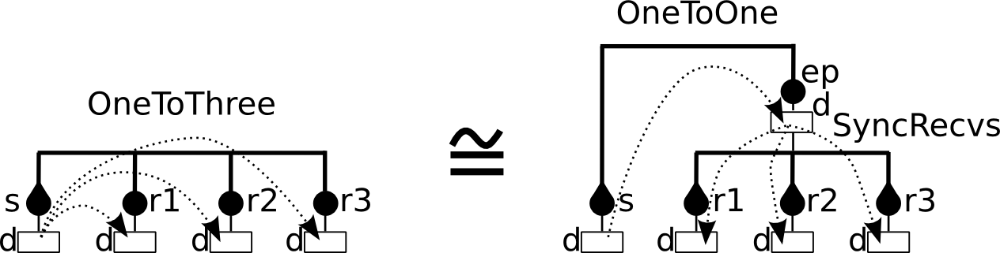

.. _tutorial-label:

Tutorial
========

The following sections show how to use BIP on very simple examples. The first
part presents general BIP recipes for commonly used patterns. The second part
shows more precisely how to interface BIP code with external C++ code with
running examples using the reference engine.

.. IMPORTANT::
   All examples in this chapter are available online :
   `<http://www-verimag.imag.fr/TOOLS/DCS/bip/examples.tar.gz>`_. Every example
   contains a ``build.sh`` script that can be used to compile the example. A
   master ``build_all.sh`` is also provided to compile all examples.

.. _tutorial-hello-world-label:

Hello world
-----------

This example will be the starting point for all other examples. 
In a file called ``HelloPackage.bip``, write the following BIP code::

  package HelloPackage
    port type HelloPort_t()

    atom type HelloAtom()
      port HelloPort_t p()
      place START,END
      initial to START
      on p from START to END
    end

    compound type HelloCompound()
      component HelloAtom c1()
    end
  end

This package contains 3 types:

* 1 port type ``HelloPort_t`` with no data parameter;
* 1 atom type ``HelloAtom`` with:

  * 1 internal port declaration ``p`` of type ``HelloPort_t``;
  * 2 places: ``START``, which is also the initial place, and ``END``;
  * 1 transition labeled by ``p`` from ``START`` to ``END``

* 1 compound type ``HelloCompound`` with:

  * 1 component declaration ``c1`` of type ``HelloAtom``.

The expected behavior, when considering a system with a component of type
``HelloCompound`` as the *root*, is a deadlock after the only transition
labelled by ``p`` is executed in the atom ``c1``.

For the sake of the example, we want to show an execution of this model and thus
we use the C++ back-end along with the reference engine. But this is not
mandatory (but as of this writing, it's the only option to execute BIP).

Compile it using the following commands for producing C++ code that is compiled
and linked with the reference engine::

  $ mkdir output
  $ bipc.sh -I . -p HelloPackage -d "HelloCompound()"\
    --gencpp-output output
  $ mkdir output/build
  $ cd output/build
  $ cmake ..
  [...]
  $ make
  [...]

And finally, run the produced ``system`` executable::

  $ ./system
  ...
  [BIP ENGINE]: initialize components...
  [BIP ENGINE]: state #0: 1 internal port:
  [BIP ENGINE]:   [0] ROOT.c1._iport_decl__p
  [BIP ENGINE]:  -> choose [0] ROOT.c1._iport_decl__p
  [BIP ENGINE]: state #1: deadlock!

After the only transition is triggered, the system reaches a deadlock state, as expected.

Synchronizing components using interactions of BIP2
---------------------------------------------------

Rendez-vous between several components
^^^^^^^^^^^^^^^^^^^^^^^^^^^^^^^^^^^^^^

.. index::
   single: rendez-vous

We modify the example of Section :ref:`tutorial-hello-world-label` so that we
now have three instances of the atom type ``HelloAtom`` instead of only one, and
we force them to synchronize their single transition (*i.e.* the
*rendez-vous*)::

  @cpp(include="stdio.h")
  package HelloPackage
    extern function printf(string, int)

    port type HelloPort_t()

    atom type HelloAtom(int id)
      export port HelloPort_t p()
      place START,END
      initial to START
      on p from START to END do {printf("Hello World from %d\n", id);}
    end

    connector type ThreeRendezVous(HelloPort_t p1, HelloPort_t p2, HelloPort_t p3)
      define p1 p2 p3
    end

    compound type HelloCompound()
      component HelloAtom c1(1), c2(2), c3(3)
      connector ThreeRendezVous connect(c1.p, c2.p, c3.p)
    end
  end

The annotation ``@cpp()`` is explained later on and allows us to use the
``printf()`` from the C standard library. In this example, we add a connector
type ``ThreeRendezVous`` with three port parameters of type ``HelloPort_t``. It
defines exactly one interaction that synchronizes the three ports.

Compile it using the following commands to produce C++ code that is compiled
and linked with the reference engine::

  $ bipc.sh -I . -p HelloPackage -d "HelloCompound()"\
    --gencpp-output output
  $ mkdir output/build
  $ cd output/build
  $ cmake ..
  [...]
  $ make
  [...]

When running the executable, you can see that the transitions of the three atoms
are triggered simultaneously. The execution of the three atoms is sequentialized
in an arbitrary order, *e.g.*::

  ...
  [BIP ENGINE]: initialize components...
  [BIP ENGINE]: state #0: 1 interaction:
  [BIP ENGINE]:   [0] ROOT.connect: ROOT.c1.p() ROOT.c2.p() ROOT.c3.p()
  [BIP ENGINE]: -> choose [0] ROOT.connect: ROOT.c1.p() ROOT.c2.p() ROOT.c3.p()
  Hello World from 1
  Hello World from 2
  Hello World from 3
  [BIP ENGINE]: state #1: deadlock!

Broadcasting data to several components
^^^^^^^^^^^^^^^^^^^^^^^^^^^^^^^^^^^^^^^

.. index::
   single: broadcast

We now consider an example composed of one component---the *sender*---that
broadcasts an integer variable representing its identifier to three other
components, the *receivers*. The corresponding BIP2 code is the following. ::
  @cpp(include="stdio.h")
  package HelloPackage
    extern function printf(string, int)
    extern function printf(string, int, int)

    port type HelloPort_t(int d)

    atom type HelloSender(int id)
      data int myd
      export port HelloPort_t p(myd)

      place START, END

      initial to START do { myd = id; }

      on p from START to END
        do { printf("I'm %d, sending Hello World....\n", myd); }
    end

    atom type HelloReceiver(int id)
      data int myd
      export port HelloPort_t p(myd)

      place START,END

      initial to START

      on p from START to END
        provided (id == 1 || id == 3)
        do { printf("I'm %d, Hello World received from %d\n", id, myd); }
    end

    connector type OneToThree(HelloPort_t s, HelloPort_t r1, HelloPort_t r2, HelloPort_t r3)
      define s' r1 r2 r3
  
      on s r1 r2 r3 down { r1.d = s.d; r2.d = s.d; r3.d = s.d; }
      on s r1 r2    down { r1.d = s.d; r2.d = s.d;             }
      on s r1    r3 down { r1.d = s.d;             r3.d = s.d; }
      on s    r2 r3 down {             r2.d = s.d; r3.d = s.d; }
      on s r1       down { r1.d = s.d;                         }
      on s    r2    down {             r2.d = s.d;             }
      on s       r3 down {                         r3.d = s.d; }
    end

    compound type HelloCompound()
      component HelloSender s(0)
      component HelloReceiver r1(1), r2(2), r3(3)
      connector OneToThree brd(s.p, r1.p, r2.p, r3.p)
    end
  end

In the connector type ``OneToThree``, the port ``s`` corresponding to the sender
is a trigger, that is, it can executes alone without synchronizing with the
other components. Since other ports are synchrons, ``OneToThree`` defines the
following interactions: '``s``', '``s,r1``', '``s,r2``', '``s,r3``',
'``s,r1,r2``', '``s,r1,r3``', '``s,r2,r3``', and '``s,r1,r2,r3``'.

To implement the broadcast of data from port ``s``, we use a list of ``on``
statements that provide ``down`` blocks of code for all the interactions
involving at least one receiver.
Notice that even if the interaction '``s``' is not included in this list, it is
still considered as a possible interaction, but no transfer of data occurs when
'``s``' executes alone.

Due to the guard of the transition labelled by ``sync`` in the receivers, the
interactions enabled after the execution of initial transitions are the
following: '``s``', '``s,r1``', '``s,r3``', and '``s,r1,r3``'.
As explained in :ref:`language-priorities-label`, the application of maximal
progress (the default priority rules of BIP2) leads to the execution of the
maximal interaction '``s,r1,r3``'::

  ...
  [BIP ENGINE]: initialize components...
  [BIP ENGINE]: state #0: 1 interaction:
  [BIP ENGINE]:   [0] ROOT.brd: ROOT.s.p({d}=0;) ROOT.r1.p({d}=0;) ROOT.r3.p({d}=0;)
  [BIP ENGINE]: -> choose [0] ROOT.brd: ROOT.s.p({d}=0;) ROOT.r1.p({d}=0;) ROOT.r3.p({d}=0;)
  I'm 0, sending Hello World....
  I'm 1, Hello World received from 0
  I'm 3, Hello World received from 0
  [BIP ENGINE]: state #1: deadlock!

   
   Broadcast from ``s`` using a single connector (left) or a hierarchical
   connector (right).

We can obtain an equivalent behavior using a hierarchical connector. In this
case, receivers are synchronized using a connector ``sync`` of type
``SyncReceivers``. ``sync`` allows any subset of receivers to participate to the
broadcast. A hierarchical connector is build on top of ``sync``. For this, we
add a broabcast between the sender and the exported port of ``sync``.
In the block of code provided below we omitted the definitions of types
``HelloPort_t``, ``HelloSender`` and ``HelloReceiver`` since there are identical
to the previous example. ::

  @cpp(include="stdio.h")
  package HelloPackage
    // [...] definitions of HelloPort_t, HelloSender and HelloReceiver

    connector type SyncRecvs(HelloPort_t r1, HelloPort_t r2, HelloPort_t r3)
      data int d
      export port HelloPort_t ep(d)
      define r1' r2' r3'
    
      on r1 r2 r3 down { r1.d = d; r2.d = d; r3.d = d; }
      on r1 r2    down { r1.d = d; r2.d = d;           }
      on r1    r3 down { r1.d = d;           r3.d = d; }
      on    r2 r3 down {           r2.d = d; r3.d = d; }
      on r1       down { r1.d = d;                     }
      on    r2    down {           r2.d = d;           }
      on       r3 down {                     r3.d = d; }
    end

    connector type OneToOne(HelloPort_t s, HelloPort_t c)
      define s' c
      on s c down { c.d = s.d; }
    end

    compound type HelloCompound()
      component HelloSender s(0)
      component HelloReceiver r1(1), r2(2), r3(3)
      connector SyncRecvs sync(r1.p, r2.p, r3.p)
      connector OneToOne brd(s.p, sync.ep)
    end
  end

The computation of the interactions in the hierarchical connector composed of
``brd`` and ``sync`` is as follows. First, all the enabled interactions of
``sync`` are computed, that is, '``r1``', '``r3``', and '``r1,r3``'. Then, from
these interactions the enabled interactions of ``brd`` are computed leading to
the following enabled interactions for ``brd``: '``s``', '``s,r1``', '``s,r3``',
and '``s,r1,r3``'. The application of priorities (i.e. maximal progress) to the
enabled interactions of ``brd`` leads to the following execution::

  ...
  [BIP ENGINE]: initialize components...
  [BIP ENGINE]: state #0: 1 interaction:
  [BIP ENGINE]:   [0] ROOT.brd: ROOT.s.p({d}=0;) ROOT.sync.ep({d}=135026452;)
  [BIP ENGINE]: -> choose [0] ROOT.brd: ROOT.s.p({d}=0;) ROOT.sync.ep({d}=135026452;)
  I'm 0, sending Hello World....
  I'm 1, Hello World received from 0
  I'm 3, Hello World received from 0
  [BIP ENGINE]: state #1: deadlock!

.. _wrapping-comp-in-compound-label:

Wrapping components in a compound
^^^^^^^^^^^^^^^^^^^^^^^^^^^^^^^^^

Suppose we want to wrap the 3 receivers of the previous example into a single
compound component, while keeping the same global behavior. We simply need to
build a compound component including the three receivers and the connector
that synchronizes them, and export the port of the connector at the interface::

  @cpp(include="stdio.h")
  package HelloPackage
    // [...] definitions of HelloPort_t, HelloSender, HelloReceiver,
    // SyncReceivers and OneToOne
  
    compound type RecvsCompound()
      component HelloReceiver c1(1), c2(2), c3(3)
      connector SyncRecvs sync(c1.p, c2.p, c3.p)
  
      export port sync.ep as p
    end
  
    compound type HelloCompound()
      component HelloSender s(0)
      component RecvsCompound rcvrs()
  
      connector OneToOne brd(s.p, rcvrs.p)
    end
  end
  
In this case, we obtain an equivalent execution sequence, that is::

  ...
  [BIP ENGINE]: initialize components...
  [BIP ENGINE]: state #0: 1 interaction:
  [BIP ENGINE]:   [0] ROOT.brd: ROOT.s.p({d}=0;) ROOT.rcvrs.p({d}=135034644;)
  [BIP ENGINE]: -> choose [0] ROOT.brd: ROOT.s.p({d}=0;) ROOT.rcvrs.p({d}=135034644;)
  I'm 0, sending Hello World....
  I'm 1, Hello World received from 0
  I'm 3, Hello World received from 0
  [BIP ENGINE]: state #1: deadlock!

.. figure::
   ../images/tutorial/tutorial-compound.png
   
   Structure of an instance of ``HelloCompound``.

Notice that in the above example, only maximal interactions of ``sync`` are
visible from ``brd``, since priorities are applied to exported port of
compounds. The resulting behavior is equivalent to the one obtained when using a
hierarchical connector without encapsulating the receivers in a compound, but
this is not the case in general, as explained as follows.

.. IMPORTANT::
   The behavior obtained when encapsulating a subset of components and
   connectors into a compound component can be different from the one of the
   original model if guards are defined in connectors. This is due to the fact
   that when the port of a connector is exported at the interface of a compound,
   the priorities are applied to the set of interactions of the connector, that
   is, only the maximal interactions are visible from the port of the compound.

This execution sequence also shows a interesting point about data handling. At the
beginning, we can see::

   ROOT.rcvrs.p({d}=135038644;)

This value ``135038644`` shows that the corresponding data has never been
initialized. Indeed, the compiler should have given you several warnings similar
to this one::

  [WARNING] In path/to/HelloPackage.bip:
  'up' maybe missing: data associated with exported port won't be "fresh" :
      34: 
      35:     on r1 r2 r3 down { r1.d = d; r2.d = d; r3.d = d; }
  ------------^
      36:     on r1 r2    down { r1.d = d; r2.d = d;           }
      37:     on r1    r3 down { r1.d = d;           r3.d = d; }
  
Please note that this is only a warning and not necessarily an error. As in this
example, it can be completely valid to omit ``up{}`` even with an exported port
with data. As long as the entity bound to the exported port does not read port's
data during the ``up{}``, there is no problem. The engine still displays the
value of the data, which has no meaningful content.

.. HINT::
   As in almost every programming language, you should refrain from having
   uninitialized data: this practice is *very* error prone and often leads to
   hard to detect bugs.

Hierarchy in BIP2
-----------------

Hierarchical connectors
^^^^^^^^^^^^^^^^^^^^^^^

The following example shows interesting aspects of the use hierarchical
connectors. It is composed of height atoms ``A1``, ``A2``, ..., ``A8`` that can
execute only if they are *active*, that is, if their integer variable ``active``
equals to ``1``. They are initially active.

.. _tutorial-figure-advanced-interactions-label:

  Structure of the model: 8 atoms, 4 levels of connectors (names of connectors of
  type ``Plus`` are not shown).

We consider four layers of connectors. The first layer connects atoms two by two
with the connectors ``plus12``, ``plus34``, ``plus56``, ``plus78`` of type
``Plus``. A connector ``plusIJ`` connects ports ``p`` of ``AI`` and ``AJ``, and
defines interactions '``AI.p``', '``AJ.p``' and '``AI.p,AJ.p``', and exports the
number of atoms participating to the interaction through its port ``ep``.

The second layer connects the connectors of the firt layer two by two, that is,
``plus1234`` connects ``plus12`` and ``plus34``, and ``plus5678`` connects
``plus56`` and ``plus78``. Since ``plus1234`` (resp. ``plus5678``) is also of
type ``Plus``, and exports the number of atoms participating to the interaction
through its port ``ep``.

The first layer consists of a single connector ``plus12345678`` of type ``Plus``
connecting the connectors of the previous layer (*i.e.* ``plus1234`` and
``plus5678``), and exporting the number of atoms participating to the
interaction.

The last layer is the connector ``filter`` of type ``Filter``, connecting the
exported port of the connector of the previous layer (*i.e.* ``plus12345678``).
It has a guard that allows the interaction '``plus12345678.ep``' only if the
value visible through the port ``ep`` of ``plus12345678`` is less or equals than
``4``, and it set this value to zero as the interaction '``plus12345678.ep``' is
executed::

  @cpp(include="stdio.h")
  package HelloPackage
    extern function printf(string, int, int)

    port type HelloPort_t(int d)

    atom type HelloAtom(int id)
      data int active
      export port HelloPort_t p(active)

      place LOOP

      initial to LOOP
        do { active = 1; }

      on p from LOOP to LOOP
        provided (active == 1)
        do { printf("I'm %d, active=%d\n", id, active); }
    end

    connector type Plus(HelloPort_t r1, HelloPort_t r2)
      data int number_of_active
      export port HelloPort_t ep(number_of_active)
      define r1' r2'
    
      on r1 r2
        up { number_of_active = r1.d + r2.d; }
        down {
          r1.d = number_of_active;
          r2.d = number_of_active;
        }

      on r1 
        up { number_of_active = r1.d; }
        down { r1.d = number_of_active; }

      on r2
        up { number_of_active = r2.d; }
        down { r2.d = number_of_active; }
    end

    connector type Filter(HelloPort_t r)
      define r

      on r provided (r.d <= 4) down { r.d = 0; }
    end

    compound type HelloCompound()
      component HelloAtom A1(1), A2(2), A3(3), A4(4), A5(5), A6(6), A7(7), A8(8)

      connector Plus plus12(A1.p, A2.p)
      connector Plus plus34(A3.p, A4.p)
      connector Plus plus56(A5.p, A6.p)
      connector Plus plus78(A7.p, A8.p)

      connector Plus plus1234(plus12.ep, plus34.ep)
      connector Plus plus5678(plus56.ep, plus78.ep)

      connector Plus plus12345678(plus1234.ep, plus5678.ep)

      connector Filter filter(plus12345678.ep)
    end
  end

The behavior of instance of ``HelloCompound`` is as follows. The first layer of
connectors enables interactions '``A1.p``', '``A2.p``', ..., '``A8.p``',
'``A1.p,A2.p``', '``A3.p,A4.p``', '``A5.p,A6.p``', and '``A7.p,A8.p``'.
These interactions are all visible from the exported port of the corresponding
connectors. The second layer allows:

* any combination between interactions '``A1.p``', '``A2.p``', '``A1.p,A2.p``'
  and interactions '``A3.p``', '``A4.p``', '``A3.p,A4.p``' due to connector
  ``plus1234``, and
* any combination between interactions '``A5.p``', '``A6.p``', '``A5.p,A6.p``'
  and interactions '``A7.p``', '``A8.p``', '``A7.p,A8.p``' due to connector
  ``plus5678``.

That is, the second layer allows any interaction between a subset of the atoms
'``A1.p``', ..., '``A4.p``', and any interaction between a subset of the atoms
'``A5.p``', ..., '``A8.p``'. Similarly, the third layer of connectors (*i.e.*
``plus12345678``) allows any interaction between a subset the height atoms.
This corresponds to a total number of 255 interactions visible from the port
``ep`` of ``plus12345678``. We provided for each exported port of connector the
corresponding number of enabled interactions in the figure.
Notice that the value exported through this port for a given interaction
corresponds exactly to the number of atoms involved in this interaction.

Due to the guard defined in ``filter``, the last layer of connectors limits the
enabled interactions to the one that involve less than, or equals to, four
atoms. The number of interactions enabled by ``filter`` is 162 = 70 + 56 + 28 +
8, where 70 is the number of interactions involving 4 atoms, 56 is the number of
interactions involving 3 atoms, 28 is the number of interactions involving two
atoms, and 8 is the number of interactions involving only one atom.

The application of maximal progress to the enabled interactions of ``filter``
leads to only 70 maximal interactions which correspond to the interactions
involving exaclty four atoms. Once such an interaction is chosen an executed,
the integer value associated to the port ``ep`` of ``plus12345678`` is set to
``0`` by the function ``down`` of connector ``filter``. This value is propagated
recursively by ``down`` functions of connectors of type ``Plus`` to the
variables ``active`` of the atoms involved in the executed interactions, and
thus disabled their transition after their execution. As a result, there is only
one maximal interaction at the next state of the model, which involves the four
atoms that have not been executed by the previous execution of interaction. Its
execution leads to a deadlock since all the atoms are *inactive* (*i.e.*
``active==1`` is false for all atoms).

A example of execution is provided below. It corresponds to the execution of
'``A1.p,A5.p,A7.p,A8.p``' first, and then '``A2.p,A3.p,A4.p,A6.p``'. Notice that
when atoms execute their transition, the value of ``active`` is ``0`` even if
its value is ``1`` before executing. This comes from the fact that, in BIP2,
guards of atoms are tested at their stable states, that is, before
synchronizing. The execution of an interaction may involve modification of the
variables of the atoms due to ``down`` functions.

::

  [BIP ENGINE]: initialize components...
  [BIP ENGINE]: state #0: 70 interactions:
  [BIP ENGINE]:   [0] ROOT.filter: ROOT.plus12345678.ep({d}=4;)
  [BIP ENGINE]:   [1] ROOT.filter: ROOT.plus12345678.ep({d}=4;)
  [BIP ENGINE]:   [2] ROOT.filter: ROOT.plus12345678.ep({d}=4;)
  [BIP ENGINE]:   [3] ROOT.filter: ROOT.plus12345678.ep({d}=4;)
  [BIP ENGINE]:   [4] ROOT.filter: ROOT.plus12345678.ep({d}=4;)
  [BIP ENGINE]:   [5] ROOT.filter: ROOT.plus12345678.ep({d}=4;)
  [BIP ENGINE]:   [6] ROOT.filter: ROOT.plus12345678.ep({d}=4;)
  [BIP ENGINE]:   [7] ROOT.filter: ROOT.plus12345678.ep({d}=4;)
  [BIP ENGINE]:   [8] ROOT.filter: ROOT.plus12345678.ep({d}=4;)
  [BIP ENGINE]:   [9] ROOT.filter: ROOT.plus12345678.ep({d}=4;)
  [BIP ENGINE]:   [10] ROOT.filter: ROOT.plus12345678.ep({d}=4;)
  [BIP ENGINE]:   [11] ROOT.filter: ROOT.plus12345678.ep({d}=4;)
  [BIP ENGINE]:   [12] ROOT.filter: ROOT.plus12345678.ep({d}=4;)
  [BIP ENGINE]:   [13] ROOT.filter: ROOT.plus12345678.ep({d}=4;)
  [BIP ENGINE]:   [14] ROOT.filter: ROOT.plus12345678.ep({d}=4;)
  [BIP ENGINE]:   [15] ROOT.filter: ROOT.plus12345678.ep({d}=4;)
  [BIP ENGINE]:   [16] ROOT.filter: ROOT.plus12345678.ep({d}=4;)
  [BIP ENGINE]:   [17] ROOT.filter: ROOT.plus12345678.ep({d}=4;)
  [BIP ENGINE]:   [18] ROOT.filter: ROOT.plus12345678.ep({d}=4;)
  [BIP ENGINE]:   [19] ROOT.filter: ROOT.plus12345678.ep({d}=4;)
  [BIP ENGINE]:   [20] ROOT.filter: ROOT.plus12345678.ep({d}=4;)
  [BIP ENGINE]:   [21] ROOT.filter: ROOT.plus12345678.ep({d}=4;)
  [BIP ENGINE]:   [22] ROOT.filter: ROOT.plus12345678.ep({d}=4;)
  [BIP ENGINE]:   [23] ROOT.filter: ROOT.plus12345678.ep({d}=4;)
  [BIP ENGINE]:   [24] ROOT.filter: ROOT.plus12345678.ep({d}=4;)
  [BIP ENGINE]:   [25] ROOT.filter: ROOT.plus12345678.ep({d}=4;)
  [BIP ENGINE]:   [26] ROOT.filter: ROOT.plus12345678.ep({d}=4;)
  [BIP ENGINE]:   [27] ROOT.filter: ROOT.plus12345678.ep({d}=4;)
  [BIP ENGINE]:   [28] ROOT.filter: ROOT.plus12345678.ep({d}=4;)
  [BIP ENGINE]:   [29] ROOT.filter: ROOT.plus12345678.ep({d}=4;)
  [BIP ENGINE]:   [30] ROOT.filter: ROOT.plus12345678.ep({d}=4;)
  [BIP ENGINE]:   [31] ROOT.filter: ROOT.plus12345678.ep({d}=4;)
  [BIP ENGINE]:   [32] ROOT.filter: ROOT.plus12345678.ep({d}=4;)
  [BIP ENGINE]:   [33] ROOT.filter: ROOT.plus12345678.ep({d}=4;)
  [BIP ENGINE]:   [34] ROOT.filter: ROOT.plus12345678.ep({d}=4;)
  [BIP ENGINE]:   [35] ROOT.filter: ROOT.plus12345678.ep({d}=4;)
  [BIP ENGINE]:   [36] ROOT.filter: ROOT.plus12345678.ep({d}=4;)
  [BIP ENGINE]:   [37] ROOT.filter: ROOT.plus12345678.ep({d}=4;)
  [BIP ENGINE]:   [38] ROOT.filter: ROOT.plus12345678.ep({d}=4;)
  [BIP ENGINE]:   [39] ROOT.filter: ROOT.plus12345678.ep({d}=4;)
  [BIP ENGINE]:   [40] ROOT.filter: ROOT.plus12345678.ep({d}=4;)
  [BIP ENGINE]:   [41] ROOT.filter: ROOT.plus12345678.ep({d}=4;)
  [BIP ENGINE]:   [42] ROOT.filter: ROOT.plus12345678.ep({d}=4;)
  [BIP ENGINE]:   [43] ROOT.filter: ROOT.plus12345678.ep({d}=4;)
  [BIP ENGINE]:   [44] ROOT.filter: ROOT.plus12345678.ep({d}=4;)
  [BIP ENGINE]:   [45] ROOT.filter: ROOT.plus12345678.ep({d}=4;)
  [BIP ENGINE]:   [46] ROOT.filter: ROOT.plus12345678.ep({d}=4;)
  [BIP ENGINE]:   [47] ROOT.filter: ROOT.plus12345678.ep({d}=4;)
  [BIP ENGINE]:   [48] ROOT.filter: ROOT.plus12345678.ep({d}=4;)
  [BIP ENGINE]:   [49] ROOT.filter: ROOT.plus12345678.ep({d}=4;)
  [BIP ENGINE]:   [50] ROOT.filter: ROOT.plus12345678.ep({d}=4;)
  [BIP ENGINE]:   [51] ROOT.filter: ROOT.plus12345678.ep({d}=4;)
  [BIP ENGINE]:   [52] ROOT.filter: ROOT.plus12345678.ep({d}=4;)
  [BIP ENGINE]:   [53] ROOT.filter: ROOT.plus12345678.ep({d}=4;)
  [BIP ENGINE]:   [54] ROOT.filter: ROOT.plus12345678.ep({d}=4;)
  [BIP ENGINE]:   [55] ROOT.filter: ROOT.plus12345678.ep({d}=4;)
  [BIP ENGINE]:   [56] ROOT.filter: ROOT.plus12345678.ep({d}=4;)
  [BIP ENGINE]:   [57] ROOT.filter: ROOT.plus12345678.ep({d}=4;)
  [BIP ENGINE]:   [58] ROOT.filter: ROOT.plus12345678.ep({d}=4;)
  [BIP ENGINE]:   [59] ROOT.filter: ROOT.plus12345678.ep({d}=4;)
  [BIP ENGINE]:   [60] ROOT.filter: ROOT.plus12345678.ep({d}=4;)
  [BIP ENGINE]:   [61] ROOT.filter: ROOT.plus12345678.ep({d}=4;)
  [BIP ENGINE]:   [62] ROOT.filter: ROOT.plus12345678.ep({d}=4;)
  [BIP ENGINE]:   [63] ROOT.filter: ROOT.plus12345678.ep({d}=4;)
  [BIP ENGINE]:   [64] ROOT.filter: ROOT.plus12345678.ep({d}=4;)
  [BIP ENGINE]:   [65] ROOT.filter: ROOT.plus12345678.ep({d}=4;)
  [BIP ENGINE]:   [66] ROOT.filter: ROOT.plus12345678.ep({d}=4;)
  [BIP ENGINE]:   [67] ROOT.filter: ROOT.plus12345678.ep({d}=4;)
  [BIP ENGINE]:   [68] ROOT.filter: ROOT.plus12345678.ep({d}=4;)
  [BIP ENGINE]:   [69] ROOT.filter: ROOT.plus12345678.ep({d}=4;)
  [BIP ENGINE]: -> choose [21] ROOT.filter: ROOT.plus12345678.ep({d}=4;)
  I'm 1, active=0
  I'm 5, active=0
  I'm 7, active=0
  I'm 8, active=0
  [BIP ENGINE]: state #1: 1 interaction:
  [BIP ENGINE]:   [0] ROOT.filter: ROOT.plus12345678.ep({d}=4;)
  [BIP ENGINE]: -> choose [0] ROOT.filter: ROOT.plus12345678.ep({d}=4;)
  I'm 2, active=0
  I'm 3, active=0
  I'm 4, active=0
  I'm 6, active=0
  [BIP ENGINE]: state #2: deadlock!

Notice that priorities---only maximal progress here---are applied globally to
the hierarchical connector defined by the four layers of connectors.
Enabled interactions of the connectors of the first, second and third layers
are all taken into account, without applying maximal progress. The behavior
would have been totally different if maximal progress was applying locally:
in this case, only the interaction involving all the atoms would be enabled by
the fird layer, leading to a deadlock due to the guard of ``filter``. This
happens if the example if modified by structuring the system using compounds, as
shown below.

Hierarchical components
^^^^^^^^^^^^^^^^^^^^^^^

The following example is a variant of the example of the previous section. We
use a hierarchy of compounds instead of a hierarchy of connectors, but the
principle remains the same.

.. _tutorial-figure-advanced-interactions-compounds-label:

  Structuring using compounds (names of connectors of type ``Plus`` are not
  shown).

::

  @cpp(include="stdio.h")
  package HelloPackage
    extern function printf(string, int, int)

    port type HelloPort_t(int d)

    atom type HelloAtom(int id)
      data int active
      export port HelloPort_t p(active)

      place LOOP

      initial to LOOP
        do { active = 1; }

      on p from LOOP to LOOP
        provided (active == 1)
        do { printf("I'm %d, active=%d\n", id, active); }
    end

    connector type Plus(HelloPort_t r1, HelloPort_t r2)
      data int number_of_active
      export port HelloPort_t ep(number_of_active)
      define r1' r2'
    
      on r1 r2
        up { number_of_active = r1.d + r2.d; }
        down { r1.d = number_of_active; r2.d = number_of_active; }

      on r1
        up { number_of_active = r1.d; }
        down { r1.d = number_of_active; }

      on r2
        up { number_of_active = r2.d; }
        down { r2.d = number_of_active; }
    end

    connector type Filter(HelloPort_t r)
      define r
      on r provided (r.d <= 4) down { r.d = 0; }
    end

    compound type Layer1(int first)
      component HelloAtom A(first), B(first + 1)

      connector Plus plus12(A.p, B.p)
      export port plus12.ep as ep
    end

    compound type Layer2(int first)
      component Layer1 L11(first), L12(first + 2)

      connector Plus plus12(L11.ep, L12.ep)
      export port plus12.ep as ep
    end

    compound type Layer3()
      component Layer2 L21(1), L22(5)

      connector Plus plus12(L21.ep, L22.ep)
      export port plus12.ep as ep
    end

    compound type HelloCompound()
      component Layer3 A12345678()

      connector Filter filter(A12345678.ep)
    end
  end

We provided for each exported port of compound the corresponding number of
enabled interactions in the figure. When executing an instance ``HelloCompound``
we obtain the following execution sequence::

  [BIP ENGINE]: initialize components...
  [BIP ENGINE]: state #0: deadlock!

.. _tutorial-petri-nets-label:

Petri nets
----------

.. index::
   single: Petri net

Most of the use cases of the BIP2 language consider automata for the behavior of
atoms. In BIP2, it is also possible to use 1-safe Petri nets (see
:ref:`language_petri_nets_label`). The following BIP2 code is an example in
which the behavior of an atom is a 1-safe Petri net representing concurrent
accesses of two processes to a shared resource. States of the first (resp.
second) process is represented by places ``GET1``, ``USE1``, ``SYNC1`` (resp.
``GET2``, ``USE2``, ``SYNC2``). The state of the resource is represented by
place ``RESOURCE``: its is marked whenever the resource is free.

Transitions represents actions of the system. With ``get1_res`` (resp.
``get2_res``) the first (resp. second) process aquires the resource and use it
(places ``USE1`` or ``USE2``). Transition ``free1_res`` (resp. ``free2_res``)
corresponds to the release of the resource by the first (resp. second) process.
Transition ``sync`` synchronizes the processes and reset them to their initial
states (places ``GET1`` and ``GET2``).

::

  @cpp(include="stdio.h")
  package HelloPetriNet
    extern function printf(string)

    port type Port()

    atom type HelloAtom()
      port Port get1_res(), get2_res(), free1_res(), free2_res(), sync()

      place GET1, GET2, RESOURCE, USE1, USE2, SYNC1, SYNC2

      initial to GET1, GET2, RESOURCE

      on get1_res from GET1, RESOURCE to USE1
        do { printf("1: get resource\n"); }

      on get2_res from GET2, RESOURCE to USE2
        do { printf("2: get resource\n"); }

      on free1_res from USE1 to SYNC1, RESOURCE
        do { printf("1: free resource\n"); }

      on free2_res from USE2 to SYNC2, RESOURCE
        do { printf("2: free resource\n"); }
      
      on sync from SYNC1, SYNC2 to GET1, GET2
        do { printf("1 & 2: synchronize\n"); }
    end

    compound type HelloCompound()
      component HelloAtom A()
    end
  end

Initially, both processes may aquire the resource since places ``GET1``,
``GET2``, ``RESOURCE`` are all marked initially. The, one of the two process
aquires the resource leading to a state in which place ``RESOURCE`` is not
marked. This ensure the mutual exclusion between the use of the resource by
the two processes: in this state, the other process cannot aquire the resource.
Once the resource is released by a process it is blocked at place ``SYNC1`` or
``SYNC2``, and the other process aquire, use and release the resource. Then both
processes are in places ``SYNC1`` and ``SYNC2`` enabling the transition ``sync``
which leads to the initial state. An example of execution is provided below.
Notice that we used the ``silent`` execution mode of the engine to remove debug
information. ::

  $ ./system --silent
  1: get resource
  1: free resource
  2: get resource
  2: free resource
  1 & 2: synchronize
  1: get resource
  1: free resource
  2: get resource
  2: free resource
  1 & 2: synchronize
  2: get resource
  2: free resource
  1: get resource
  1: free resource
  1 & 2: synchronize
  ...

.. _tutorial-non-determinism-label:

Priorities
----------

Priorities in atoms
^^^^^^^^^^^^^^^^^^^
.. index::
   single: priority
   pair:   priority; atom

The following example is composed of a single atom that can, at each state,
either executes a transition labelled by the internal port ``p``, or a
transition labelled by the internal port ``q``. ::

  package priorities_in_atom
    port type Port()

    atom type MyAtom()
      port Port p(), q()

      place LOOP

      initial to LOOP

      on p from LOOP to LOOP
      on q from LOOP to LOOP
    end

    compound type Model()
      component MyAtom a()
    end
  end

The execution of the C++ code obtained from the compilation of an instance of
``Model`` shows that at each state the two internal ports ``p`` and ``q`` can be
executed. Thus, the model defines at infinite number of execution sequences. In
the standard execution mode of the engine, the choice of the port is made
randomly. A typical execution for this example is the following::
  
  ...
  [BIP ENGINE]: initialize components...
  [BIP ENGINE]: state #0: 2 internal ports:
  [BIP ENGINE]:   [0] ROOT.a._iport_decl__p
  [BIP ENGINE]:   [1] ROOT.a._iport_decl__q
  [BIP ENGINE]:  -> choose [0] ROOT.a._iport_decl__p
  [BIP ENGINE]: state #1: 2 internal ports:
  [BIP ENGINE]:   [0] ROOT.a._iport_decl__p
  [BIP ENGINE]:   [1] ROOT.a._iport_decl__q
  [BIP ENGINE]:  -> choose [1] ROOT.a._iport_decl__q
  [BIP ENGINE]: state #2: 2 internal ports:
  [BIP ENGINE]:   [0] ROOT.a._iport_decl__p
  [BIP ENGINE]:   [1] ROOT.a._iport_decl__q
  [BIP ENGINE]:  -> choose [0] ROOT.a._iport_decl__p
  [BIP ENGINE]: state #3: 2 internal ports:
  [BIP ENGINE]:   [0] ROOT.a._iport_decl__p
  [BIP ENGINE]:   [1] ROOT.a._iport_decl__q
  [BIP ENGINE]:  -> choose [0] ROOT.a._iport_decl__p
  ...

Using priorities to inhibit the execution of port ``q``
""""""""""""""""""""""""""""""""""""""""""""""""""""""""

Wa can modify the following example to prevent from execution of the transition
labelled by ``q`` by simply giving the priority rule ``q < p`` in
``MyAtom``. We could also use ``q < *`` which gives less priority to ``q``
than any other port::

  package priorities_in_atom
    port type Port()

    atom type MyAtom()
      port Port p(), q()

      place LOOP

      initial to LOOP

      on p from LOOP to LOOP
      on q from LOOP to LOOP

      priority myPrio q < p
    end

    compound type Model()
      component MyAtom a()
    end
  end

In this case, only the transition corresponding to the internal port ``p`` can
be executed. Notice that in this case the model defines a single execution
sequence, which is the following::

  ...
  [BIP ENGINE]: initialize components...
  [BIP ENGINE]: state #0: 1 internal port:
  [BIP ENGINE]:   [0] ROOT.a._iport_decl__p
  [BIP ENGINE]:  -> choose [0] ROOT.a._iport_decl__p
  [BIP ENGINE]: state #1: 1 internal port:
  [BIP ENGINE]:   [0] ROOT.a._iport_decl__p
  [BIP ENGINE]:  -> choose [0] ROOT.a._iport_decl__p
  [BIP ENGINE]: state #2: 1 internal port:
  [BIP ENGINE]:   [0] ROOT.a._iport_decl__p
  [BIP ENGINE]:  -> choose [0] ROOT.a._iport_decl__p
  [BIP ENGINE]: state #3: 1 internal port:
  [BIP ENGINE]:   [0] ROOT.a._iport_decl__p
  [BIP ENGINE]:  -> choose [0] ROOT.a._iport_decl__p
  ...

Priorities in an atom is a partial order between its internal ports. It is
computed from the rules provided by ``priority`` statements: it is the result of
the application of the transitive closure to the rules. We modify the previous
example as follows. We add an internal port ``r`` such that no transition
labelled by ``r`` is enabled during the execution. Instead of using the priority
rule ``q < p``, we use rules ``q < r`` and ``r < p``. Due to the computation of
the transitive closure before the application of priorities, only transition
labelled by ``p`` can be executed, leading to the execution sequence of the
previous example (see above). Even if no transition labelled by ``r`` is
enabled, the priority rule ``q < p`` is automatically deduced from the rules
``q < r`` and ``r < p``. ::

  package priorities_in_atom
    port type Port()

    atom type MyAtom()
      data int i
      port Port p(), q(), r()

      place LOOP, NON_REACHABLE

      initial to LOOP
        do { i=0; }

      on p from LOOP to LOOP
        do { i=i+1; }

      on q from LOOP to LOOP
        do { i=i+1; }

      on r from NON_REACHABLE to NON_REACHABLE

      priority myPrio1 q < r
      priority myPrio2 r < p
    end

    compound type Model()
      component MyAtom a()
    end
  end

Notice that a set of rule may define a cyclic relation. Adding the rule
``priority myPrio3 p < q`` to ``MyAtom`` in the previous example leads to
following error raised by the BIP2 compiler::

  [SEVERE] In /home/to/example/priorities_in_atom.bip:
  Cycle found in priorities in Atom type :
      20: 
      21:     priority myPrio1 q < r
  ------------^
      22:     priority myPrio2 r < p
      23:     priority myPrio3 p < q

.. index::
   single: priority; dynamic

Priorities may be also defined dynamically using guards involving variables. In
this case, cycles are checked at run-time. An example of dynamic priority can be
found in the following section.

Using priorities to enforce an order of execution
"""""""""""""""""""""""""""""""""""""""""""""""""

We can also modify the previous example to execute both transitions labelled
by ports ``p`` and ``q``, but with imposing the order of execution by using
priorities. Assume we want to enforce that ``p`` and ``q`` are alternately
executed, starting by ``p``. For this, we first add an integer variable ``i``
representing the state number of the atom, that is, it is initialized at ``0``
and incremented every transition execution. We also give more priority to ``p``
for even state numbers, and more priority for ``q`` for odd state numbers. ::

  package priorities_in_atom
    port type Port()

    atom type MyAtom()
      data int i
      port Port p(), q()

      place LOOP

      initial to LOOP
        do { i=0; }

      on p from LOOP to LOOP
        do { i=i+1; }

      on q from LOOP to LOOP
        do { i=i+1; }

      priority myPrioEven q < p provided ((i%2) == 0) 
      priority myPrioOdd  p < q provided ((i%2) == 1) 
    end

    compound type Model()
      component MyAtom a()
    end
  end

Notice that the compilation of the previous BIP2 code leads to the following
warning due to the potential cycle in priorities introduced by the rules ``myPrioEven`` and ``myPrioOdd``::

  [WARNING] In /home/to/example/priorities_in_atom.bip:
  Cycle found in priorities in Atom type :
      18: 
      19:     priority myPrioEven q < p provided ((i%2) == 0) 
  ------------^
      20:     priority myPrioOdd  p < q provided ((i%2) == 1) 
      21:   end

This cycle can only occur if both guards ``((i%2) == 0)`` and ``((i%2) == 1)``
evaluates to true for the same state, which can never happen (otherwise an error
will be reported at run-time).
The execution of the model corresponds to the expected behavior, that is, the
alternation of the execution of ``p`` and ``q``. Notice that in this case, the
model defines also a single execution sequence, as follows::

  ...
  [BIP ENGINE]: initialize components...
  [BIP ENGINE]: state #0: 1 internal port:
  [BIP ENGINE]:   [0] ROOT.a._iport_decl__p
  [BIP ENGINE]:  -> choose [0] ROOT.a._iport_decl__p
  [BIP ENGINE]: state #1: 1 internal port:
  [BIP ENGINE]:   [0] ROOT.a._iport_decl__q
  [BIP ENGINE]:  -> choose [0] ROOT.a._iport_decl__q
  [BIP ENGINE]: state #2: 1 internal port:
  [BIP ENGINE]:   [0] ROOT.a._iport_decl__p
  [BIP ENGINE]:  -> choose [0] ROOT.a._iport_decl__p
  [BIP ENGINE]: state #3: 1 internal port:
  [BIP ENGINE]:   [0] ROOT.a._iport_decl__q
  [BIP ENGINE]:  -> choose [0] ROOT.a._iport_decl__q
  [BIP ENGINE]: state #4: 1 internal port:
  [BIP ENGINE]:   [0] ROOT.a._iport_decl__p
  [BIP ENGINE]:  -> choose [0] ROOT.a._iport_decl__p
  [BIP ENGINE]: state #5: 1 internal port:
  [BIP ENGINE]:   [0] ROOT.a._iport_decl__q
  [BIP ENGINE]:  -> choose [0] ROOT.a._iport_decl__q
  [BIP ENGINE]: state #6: 1 internal port:
  [BIP ENGINE]:   [0] ROOT.a._iport_decl__p
  [BIP ENGINE]:  -> choose [0] ROOT.a._iport_decl__p
  ...

If guards of priorities ``myPrioEven`` are ``myPrioOdd`` are enabled at the same
state of the model an error is reported when executing the model,  *e.g.* if
both guards are ``((i%2) == 0)`` the execution is as follows::

  ...
  [BIP ENGINE]: initialize components...
  [BIP ENGINE]: ERROR: cycle in priorities! (p < q < p)

Priorities in compounds
^^^^^^^^^^^^^^^^^^^^^^^

Similarly to the use of priorities in atoms, when several interactions are
enabled at a given state of a compound, priorities can be used to prevent some
of them from executing.

::

  package priorities_in_compound
    port type Port()

    atom type MyAtom(int enabled)
      export port Port p()

      place SYNC, END

      initial to SYNC

      on p from SYNC to END
        provided (enabled == 1)
    end

    connector type Broadcast(Port p, Port q, Port r)
      define p' q r
      on p provided (false)
    end

    compound type Model()
      component MyAtom A(1), B(1), C(0)
      component MyAtom D(1), E(1), F(1)

      connector Broadcast brdABC(A.p, B.p, C.p)
      connector Broadcast brdDEF(D.p, E.p, F.p)
    end
  end

In the above example, we synchronize components ``A``, ``B``, ``C``, ``D``
``E``, ``F`` using two connectors ``brdABC`` and ``brdDEF`` of type
``Broadcast``. Since ports ``p`` of ``A`` is considered as a trigger in
connector ``brdABC``, ``brdABC`` defines (statically) interactions '``A.p``',
'``A.p,B.p``', '``A.p,C.p``' and '``A.p,B.p,C.p``'. Similarly, ``brdDEF``
defines '``D.p``', '``D.p,E.p``', '``D.p,F.p``' and '``D.p,E.p,F.p``'. Due to
the guard ``false`` in ``Broadcast``, interactions '``A.p``' and '``D.p``' are
disabled. Moreover, due to the guard ``(enabled == 1)`` in ``MyAtom`` and the
parameter ``0`` of ``C``, interactions ``A.p,C.p``' and '``A.p,B.p,C.p``' are
also disabled.
As a result, interactions enabled after initialization are: '``A.p,B.p``' in
``brdABC`` and '``D.p,E.p``', '``D.p,F.p``' and '``D.p,E.p,F.p``' in ``brdDEF``.

.. index::
   single: maximal progress
   single: priority; maximal progress

In BIP2, maximal progress is considered as default priorities. Given a
connector, maximal progress gives higher priority to larger interactions. In the
above example, interactions '``D.p,E.p``' and '``D.p,F.p``' of connector
``brdDEF`` are not maximal since a larger interaction---'``D.p,E.p,F.p``'---is
enabled in the same connector. As a result, execution sequences of instances of
``Model`` corresponds to the execution of '``A.p,B.p``' and '``D.p,E.p,F.p``' in
an arbitrary order, that is, either the following execution sequence if
'``A.p,B.p``' is executed first::

  ...
  [BIP ENGINE]: initialize components...
  [BIP ENGINE]: state #0: 2 interactions:
  [BIP ENGINE]:   [0] ROOT.brdABC: ROOT.A.p() ROOT.B.p()
  [BIP ENGINE]:   [1] ROOT.brdDEF: ROOT.D.p() ROOT.E.p() ROOT.F.p()
  [BIP ENGINE]: -> choose [0] ROOT.brdABC: ROOT.A.p() ROOT.B.p()
  [BIP ENGINE]: state #1: 1 interaction:
  [BIP ENGINE]:   [0] ROOT.brdDEF: ROOT.D.p() ROOT.E.p() ROOT.F.p()
  [BIP ENGINE]: -> choose [0] ROOT.brdDEF: ROOT.D.p() ROOT.E.p() ROOT.F.p()
  [BIP ENGINE]: state #2: deadlock!

or the following execution sequence if '``D.p,E.p,F.p``' is executed first::

  ...
  [BIP ENGINE]: initialize components...
  [BIP ENGINE]: state #0: 2 interactions:
  [BIP ENGINE]:   [0] ROOT.brdABC: ROOT.A.p() ROOT.B.p()
  [BIP ENGINE]:   [1] ROOT.brdDEF: ROOT.D.p() ROOT.E.p() ROOT.F.p()
  [BIP ENGINE]: -> choose [1] ROOT.brdDEF: ROOT.D.p() ROOT.E.p() ROOT.F.p()
  [BIP ENGINE]: state #1: 1 interaction:
  [BIP ENGINE]:   [0] ROOT.brdABC: ROOT.A.p() ROOT.B.p()
  [BIP ENGINE]: -> choose [0] ROOT.brdABC: ROOT.A.p() ROOT.B.p()
  [BIP ENGINE]: state #2: deadlock!

Using priorities to enforce an order of execution
"""""""""""""""""""""""""""""""""""""""""""""""""

We can modify the previous example to enfore the execution of the interaction
'``D.p,E.p,F.p``' of ``brdDEF`` before the execution of the interaction
'``A.p,B.p``' of ``brdABC``. For this, we add the following priority rule in
``Model``::

  priority scheduler brdABC:A.p,B.p < brdDEF:D.p,E.p,F.p

This ensures that the model has a single execution sequence which is the
following::

  ...
  [BIP ENGINE]: initialize components...
  [BIP ENGINE]: state #0: 1 interaction:
  [BIP ENGINE]:   [1] ROOT.brdDEF: ROOT.D.p() ROOT.E.p() ROOT.F.p()
  [BIP ENGINE]: -> choose [0] ROOT.brdDEF: ROOT.D.p() ROOT.E.p() ROOT.F.p()
  [BIP ENGINE]: state #1: 1 interaction:
  [BIP ENGINE]:   [0] ROOT.brdABC: ROOT.A.p() ROOT.B.p()
  [BIP ENGINE]: -> choose [0] ROOT.brdABC: ROOT.A.p() ROOT.B.p()
  [BIP ENGINE]: state #2: deadlock!

Notice that after initialization, only interaction '``D.p,E.p,F.p``' is listed
by the engine, since it can only executes maximal interactions. Replacing the
priority rule ``scheduler`` by ``brdABC:A.p,B.p,C.p < brdDEF: D.p`` leads to
the same execution sequence. This is due to the fact that priorities are
computed as the transitive closure of the union of maximal progress and the
priority rules provided by ``priority`` statements. Even if interactions 
'``A.p,B.p,C.p``' is not enabled by ``brdABC``, and interaction ``D.p`` is not
enabled by ``brdDEF``, priority rule ``brdABC:A.p,B.p < brdDEF: D.p,E.p,F.p``
is deduced from maximal progress that enforces 
``brdABC:A.p,B.p < brdABC:A.p,B.C.p`` and ``brdDEF: D.p < brdDEF:D.p,E.p,F.p``,
and from ``brdABC:A.p,B.p,C.p < brdDEF: D.p``.

Notice also that priority rules must only involve interactions that are defined
by the connectors (*i.e.* by the expression provided with the statement
``define``). As a result, if the priority rule ``scheduler`` is replaced by
``brdABC:A.p,B.p,C.p < brdDEF: E.p``, an error is reported when compiling the
model::

  [SEVERE] In /home/to/example/priorities_in_compound.bip:
  Interaction not allowed as not defined by connector type :
      26: 
      27:     priority scheduler brdABC:A.p,B.p,C.p < brdDEF:E.p
  ----------------------------------------------------^
      28:   end
      29: end

Dynamic priorities and invisible states
"""""""""""""""""""""""""""""""""""""""

In the following example, the components ``A`` and ``B`` represent potential
users of a resource which is represented by the component ``R``. When a user
``A`` or ``B`` reaches the place ``FREE``, it set its variable ``free`` to ``1``
which is exported to inform that it is not using the resource ``R``. The
variable ``free`` or a user is set to ``O`` when it leaves the place ``FREE`` to
inform that it reaches the place ``WAIT`` from which it may use the resource.
To prevent from concurrent use of the resource, a scheduler has been implemented
using priorities, as explained as follows. It gives more priority to ``B``
provided ``B`` is in place ``FREE``, that is, its variable ``free`` equals to
``O``. Notice that use of '``*``' in the priority rule: it gives less priority
to interactions of defined in ``A_utilize_R`` than any interaction defined in
any connector except ``A_utilize_R``. ::

  package priorities_invisible
    port type Port()

    atom type Resource()
      export port Port utilize()

      place WAIT

      initial to WAIT

      on utilize from WAIT to WAIT
    end

    atom type UserOfRessource()
      export data int free
      export port Port utilize()

      place WAIT, FREE

      initial to WAIT
        do { free = 0; }

      on utilize from WAIT to FREE
        do { free = 1; }

      internal from FREE to WAIT
        do { free = 0; }
    end

    connector type RDV(Port p, Port q)
      define p q
    end

    compound type Model()
      component Resource R()
      component UserOfRessource A(), B()

      connector RDV A_utilize_R(A.utilize, R.utilize)
      connector RDV B_utilize_R(B.utilize, R.utilize)

      priority scheduler A_utilize_R:* < *:* provided (B.free == 0)
    end
  end

When compiling and executing an instance of ``Model``, we obtain an execution
in which only component ``B`` is executing. This comes from the fact that the
transition from place ``FREE`` to place ``WAIT`` in ``B`` is internal, that is,
it is the state of ``B`` before the its execution is invisible. As a result,
interactions of ``A_utilize_R`` can never executes since the visible value of
``B.free`` is always ``0``. ::

  ...
  [BIP ENGINE]: initialize components...
  [BIP ENGINE]: state #0: 1 interaction:
  [BIP ENGINE]:   [0] ROOT.B_utilize_R: ROOT.B.utilize() ROOT.R.utilize()
  [BIP ENGINE]: -> choose [0] ROOT.B_utilize_R: ROOT.B.utilize() ROOT.R.utilize()
  [BIP ENGINE]: state #1: 1 interaction:
  [BIP ENGINE]:   [0] ROOT.B_utilize_R: ROOT.B.utilize() ROOT.R.utilize()
  [BIP ENGINE]: -> choose [0] ROOT.B_utilize_R: ROOT.B.utilize() ROOT.R.utilize()
  [BIP ENGINE]: state #2: 1 interaction:
  [BIP ENGINE]:   [0] ROOT.B_utilize_R: ROOT.B.utilize() ROOT.R.utilize()
  [BIP ENGINE]: -> choose [0] ROOT.B_utilize_R: ROOT.B.utilize() ROOT.R.utilize()
  [BIP ENGINE]: state #3: 1 interaction:
  [BIP ENGINE]:   [0] ROOT.B_utilize_R: ROOT.B.utilize() ROOT.R.utilize()
  [BIP ENGINE]: -> choose [0] ROOT.B_utilize_R: ROOT.B.utilize() ROOT.R.utilize()
  ...

The problem can be fixed by using a transition labelled by an internal port
instead of an internal transition. A correct version of ``UserOfRessource`` is
provided below. ::

 atom type UserOfRessource()
    export data int free
    port Port notfree()
    export port Port utilize()

    place WAIT, FREE

    initial to WAIT
      do { free = 0; }

    on utilize from WAIT to FREE
      do { free = 1; }

    on notfree from FREE to WAIT
      do { free = 0; }
  end

The corresponding execution involves both components ``A`` and ``B``. ``A`` can
only be executed when component ``B`` is in place ``FREE``. ::

  ...
  [BIP ENGINE]: initialize components...
  [BIP ENGINE]: state #0: 1 interaction:
  [BIP ENGINE]:   [0] ROOT.B_utilize_R: ROOT.B.utilize() ROOT.R.utilize()
  [BIP ENGINE]: -> choose [0] ROOT.B_utilize_R: ROOT.B.utilize() ROOT.R.utilize()
  [BIP ENGINE]: state #1: 1 interaction and 1 internal port:
  [BIP ENGINE]:   [0] ROOT.A_utilize_R: ROOT.A.utilize() ROOT.R.utilize()
  [BIP ENGINE]:   [1] ROOT.B._iport_decl__notfree
  [BIP ENGINE]:  -> choose [0] ROOT.B._iport_decl__notfree
  [BIP ENGINE]: state #2: 1 interaction:
  [BIP ENGINE]:   [0] ROOT.B_utilize_R: ROOT.B.utilize() ROOT.R.utilize()
  [BIP ENGINE]: -> choose [0] ROOT.B_utilize_R: ROOT.B.utilize() ROOT.R.utilize()
  [BIP ENGINE]: state #3: 1 interaction and 1 internal port:
  [BIP ENGINE]:   [0] ROOT.A_utilize_R: ROOT.A.utilize() ROOT.R.utilize()
  [BIP ENGINE]:   [1] ROOT.B._iport_decl__notfree
  [BIP ENGINE]:  -> choose [0] ROOT.B._iport_decl__notfree
  [BIP ENGINE]: state #4: 1 interaction:
  [BIP ENGINE]:   [0] ROOT.B_utilize_R: ROOT.B.utilize() ROOT.R.utilize()
  [BIP ENGINE]: -> choose [0] ROOT.B_utilize_R: ROOT.B.utilize() ROOT.R.utilize()
  [BIP ENGINE]: state #5: 1 interaction and 1 internal port:
  [BIP ENGINE]:   [0] ROOT.A_utilize_R: ROOT.A.utilize() ROOT.R.utilize()
  [BIP ENGINE]:   [1] ROOT.B._iport_decl__notfree
  [BIP ENGINE]: -> choose [0] ROOT.A_utilize_R: ROOT.A.utilize() ROOT.R.utilize()
  ...

.. _tutorial-cpp-label:

Using the C++ back-end
----------------------

Hello World using a preinstalled library
^^^^^^^^^^^^^^^^^^^^^^^^^^^^^^^^^^^^^^^^

The initial *Hello World* example does not display anything on its own. In this
example, we add such simple display by using the common ``printf()`` from
standard C library.

Change the initial example to match the following::

  @cpp(include="stdio.h")
  package HelloPackage
    extern function printf(string)

    port type HelloPort_t()

    atom type HelloAtom()
      port HelloPort_t p()
      place START,END
      initial to START
      on p from START to END do { printf("Hello World!\n"); }
    end

    compound type HelloCompound()
      component HelloAtom c1()
    end
  end

The annotation instructs the code generator to include the ``stdio.h`` C
standard library in the generated code for this package. This allows the use of
``printf()``.

The compilation stays the same::

  $ bipc.sh -I . -p HelloPackage -d "HelloCompound()" \
    --gencpp-output output
  $ mkdir output/build
  $ cd output/build
  $ cmake ..
  [...]
  $ make
  [...]

When running the example, you can see our ``printf()`` being executed when the
transition is fired::

  [BIP ENGINE]: initialize components...
  [BIP ENGINE]: state #0: 1 internal port:
  [BIP ENGINE]:   [0] ROOT.c1._iport_decl__p
  [BIP ENGINE]:  -> choose [0] ROOT.c1._iport_decl__p
  Hello World
  [BIP ENGINE]: state #1: deadlock!

Hello World with external code
^^^^^^^^^^^^^^^^^^^^^^^^^^^^^^

Let's modify again our example. This time, we will also provide the code needed
for printing the message to the console instead of relying directly on a
*standard library*.

Change the previous ``HelloPackage.bip`` by adding an extra annotation on the
package definition::

  @cpp(src="ext-cpp/HelloPackage.cpp",include="HelloPackage.hpp")
  package HelloPackage
    extern function my_print(string)

    port type HelloPort_t()

    atom type HelloAtom()
      port HelloPort_t p()
      place START,END
      initial to START
      on p from START to END do { my_print("Hello World!\n"); }
    end

    compound type HelloCompound()
      component HelloAtom c1()
    end
  end

Along with the BIP file, you need to create the external code that will provide
the ``my_print("....")`` function:

* the interface (*ie.* ``HelloPackage.hpp``) that you need to put in a directory
  that will be included in the C++ compiler search path.
* the implementation (*ie.* ``HelloPackage.cpp``) corresponding to the previous
  interface.

Any directory layout can be used. We propose the following as example::

  .
   ext-cpp
      HelloPackage.cpp
     ` HelloPackage.hpp
  ` HelloPackage.bip

With the following content for ``HelloPackage.hpp``::

  void my_print(const char *message);

And for ``HelloPackage.cpp``::

  #include <iostream>

  void my_print(const char *message){
    std::cout << "Someone says: " << message;
  }

Then, compile it using the following commands::

  $ bipc.sh -I . -p HelloPackage -d "HelloCompound()"\
    --gencpp-output output \
    --gencpp-cc-I $PWD/ext-cpp
  $ mkdir output/build
  $ cd output/build
  $ cmake ..
  [...]
  $ make
  [...]

The ``--gencpp-cc-I`` is used to included the directory containing our ``.hpp``
file to the C++ compiler include paths list.

And finally, run the produced ``system`` executable::

  $ ./system
  [BIP ENGINE]: initialize components...
  [BIP ENGINE]: state #0: 1 internal port:
  [BIP ENGINE]:   [0] ROOT.c1._iport_decl__p
  [BIP ENGINE]:  -> choose [0] ROOT.c1._iport_decl__p
  Someone says: Hello World
  [BIP ENGINE]: state #1: deadlock!

Hello World with data and external code
^^^^^^^^^^^^^^^^^^^^^^^^^^^^^^^^^^^^^^^

.. index::
   pair: C++; external code

In this example, we modify again our *Hello World*, this time to pass some data
to the external code.

The new BIP code is now::

  @cpp(src="ext-cpp/HelloPackage.cpp",include="HelloPackage.hpp")
  package HelloPackage
    extern function my_print(string, int)

    port type HelloPort_t()

    atom type HelloAtom()
      data int somedata
      port HelloPort_t p()
      place START,END
      initial to START do { somedata = 0; }
      on p from START to END do {my_print("Hello World", somedata);}
    end

    compound type HelloCompound()
      component HelloAtom c1()
    end
  end

The ``my_print()`` is changed to accept an extra *int* parameter. Note that this
parameter is a C++ *reference*: the function has access to the real data, not a copy.

``HelloPackage.hpp``::

  void my_print(const char *message, int &adata);

``HelloPackage.cpp``::

  #include <iostream>

  void my_print(const char *message, int &adata){
    std::cout << "Someone says: " << message << " with data=" << adata << std::endl;
  }

The compilation is still the same::

  $ bipc.sh -I . -p HelloPackage -d "HelloCompound()"\
    --gencpp-output output \
    --gencpp-cc-I $PWD/ext-cpp
  $ mkdir output/build
  $ cd output/build
  $ cmake ..
  [...]
  $ make
  [...]

When running the executable, we can see that the value for the data is correctly
display::

  [BIP ENGINE]: initialize components...
  [BIP ENGINE]: state #0: 1 internal port:
  [BIP ENGINE]:   [0] ROOT.c1._iport_decl__p
  [BIP ENGINE]:  -> choose [0] ROOT.c1._iport_decl__p
  Someone says: Hello World with data=0
  [BIP ENGINE]: state #1: deadlock!

Hello World with data modified by external code
^^^^^^^^^^^^^^^^^^^^^^^^^^^^^^^^^^^^^^^^^^^^^^^

The previous example simply shows how to read data received from BIP inside
external code. The external code can also modify this code (if called from a
context that allows the modification of the data). We add a new ``my_modify()``
function in our external code that only modifies its integer parameter.

The new BIP code::

  @cpp(src="ext-cpp/HelloPackage.cpp",include="HelloPackage.hpp")
  package HelloPackage
    extern function my_modify(int)
    extern function my_print(string, int)

    port type HelloPort_t()

    atom type HelloAtom()
      data int somedata
      port HelloPort_t p()
      place START, S, END
      initial to START do { somedata = 0; }
      on p from START to S do { my_modify(somedata); }
      on p from S to END do { my_print("Hello World", somedata);}
    end

    compound type HelloCompound()
      component HelloAtom c1()
    end
  end

The new ``HelloPackage.hpp``::

  void my_print(const char *message, int &adata);
  void my_modify(int &adata);

And the corresponding ``HelloPackage.cpp``::

  #include <iostream>

  void my_print(const char *message, int &adata){
    std::cout << "Someone says: " << message << " with data=" << adata << std::endl;
  }

  void my_modify(int &adata){
    adata = 999;
  }

The compilation is still the same::

  $ bipc.sh -I . -p HelloPackage -d "HelloCompound()"\
    --gencpp-output output \
    --gencpp-cc-I $PWD/ext-cpp
  $ mkdir output/build
  $ cd output/build
  $ cmake ..
  [...]
  $ make
  [...]

When running the example, we can see that the integer is correctly modified::

  $ ./system 
  [BIP ENGINE]: initialize components...
  [BIP ENGINE]: state #0: 1 internal port:
  [BIP ENGINE]:   [0] ROOT.c1._iport_decl__p
  [BIP ENGINE]:  -> choose [0] ROOT.c1._iport_decl__p
  [BIP ENGINE]: state #1: 1 internal port:
  [BIP ENGINE]:   [0] ROOT.c1._iport_decl__p
  [BIP ENGINE]:  -> choose [0] ROOT.c1._iport_decl__p
  Someone says: Hello World with data=999
  [BIP ENGINE]: state #2: deadlock!

Hello World with external code called from const context
^^^^^^^^^^^^^^^^^^^^^^^^^^^^^^^^^^^^^^^^^^^^^^^^^^^^^^^^

.. index::
   pair: C++; const context

When calling function from const context (*eg.* connector's up, all guards), one
must take extra care when interfacing the external code using data. Again, we
extend our ``HelloPackage`` by adding a guard calling an external function
called ``my_guard()`` that accesses the component's data.

The new BIP::

  @cpp(src="ext-cpp/HelloPackage.cpp",include="HelloPackage.hpp")
  package HelloPackage
    extern function bool my_guard(int)
    extern function my_modify(int)
    extern function my_print(string, int)

    port type HelloPort_t()

    atom type HelloAtom()
      data int somedata
      port HelloPort_t p(), positive(), negative()
      place START, S, END
      initial to START do { somedata = 0; }
      on p from START to S do { my_modify(somedata); }
      on negative from S to END 
        provided (my_guard(somedata))
        do {my_print("Positive data", somedata);}
      on positive from S to END
        provided (!my_guard(somedata))
        do {my_print("Negative data", somedata);}
    end

    compound type HelloCompound()
      component HelloAtom c1()
    end
  end

Note that the new ``HelloPackage.hpp`` includes the declaration of
``const_my_guard()`` and not ``my_guard()``. This is because our BIP calls
``my_guard()`` from a *const* context::

  void my_print(const char *message, int &adata);
  void my_modify(int &adata);
  bool const_my_guard(int &adata);

The corresponding ``HelloPackage.cpp``::

  #include <iostream>

  void my_print(const char *message, int &adata){
    std::cout << "Someone says: " << message << " with data=" << adata << std::endl;
  }

  void my_modify(int &adata){
    adata = 999;
  }

  bool const_my_guard(int &adata){
    return adata > 0;
  }

The compilation is still the same::

  $ bipc.sh -I . -p HelloPackage -d "HelloCompound()"\
    --gencpp-output output \
    --gencpp-cc-I $PWD/ext-cpp
  $ mkdir output/build
  $ cd output/build
  $ cmake ..
  [...]
  $ make
  [...]

When executing, we can see that the transition for the *positive* transition is
fired::

  [BIP ENGINE]: initialize components...
  [BIP ENGINE]: state #0: 1 internal port:
  [BIP ENGINE]:   [0] ROOT.c1._iport_decl__p
  [BIP ENGINE]:  -> choose [0] ROOT.c1._iport_decl__p
  [BIP ENGINE]: state #1: 1 internal port:
  [BIP ENGINE]:   [0] ROOT.c1._iport_decl__negative
  [BIP ENGINE]:  -> choose [0] ROOT.c1._iport_decl__negative
  Someone says: Positive data with data=999
  [BIP ENGINE]: state #2: deadlock!

Using custom type
^^^^^^^^^^^^^^^^^

.. index::
   pair: C++; external data type

We will now use custom type in a simple rendez-vous example involving 3
atoms. The expected behavior is very simple:

* each atom calls the ``init_data()`` function to initialize its internal
  data. All atoms get different values.
* they all synchronize and the connector takes the values from the 3rd atom and
  writes it in the other 2 atoms.

The atoms display their data before and after the synchronization.

For using a custom type, we need:

* to declare the type in the BIP source
* to define the type in the C++ extern code

In this example, we don't provide serialization support (this will be
demonstrated in the next example).

The source code files are given below.

``HelloPackage.bip``::
  
  @cpp(src="ext-cpp/HelloPackage.cpp",include="HelloPackage.hpp")
  package HelloPackage
    extern data type my_custom_type
    extern function init_data(int, my_custom_type)
    extern function print_data(int, my_custom_type)
  
    port type HelloPort_t(my_custom_type d)
  
    atom type HelloAtom(int id)
      data my_custom_type d
      export port HelloPort_t p(d)
      place START,END
      initial to START do {init_data(id, d); print_data(id, d);}
      on p from START to END do {print_data(id, d);}
    end
  
    connector type ThreeRendezVous(HelloPort_t p1, HelloPort_t p2, HelloPort_t p3)
    define p1 p2 p3
    on p1 p2 p3 down { p1.d = p3.d; p2.d = p3.d; }
    end
  
    compound type HelloCompound()
      component HelloAtom c1(1), c2(2), c3(3)
      connector ThreeRendezVous connect(c1.p, c2.p, c3.p)
    end
  end

``HelloPackage.hpp``::

  #ifndef HP_HPP
  #define HP_HPP
  
  typedef struct {
    int x,y;
  } my_custom_type;
  
  void print_data(int id, my_custom_type &adata);
  void init_data(int id, my_custom_type &adata);
  
  #endif
  
  
``HelloPackage.cpp``::
  
  #include <iostream>
  #include "HelloPackage.hpp"
  
  void print_data( int id, my_custom_type &adata){
    std::cout << "Data for: " << id << " = " << adata.x
  	    << "," << adata.y << std::endl;
  }
  
  void init_data(int id, my_custom_type &adata){
    adata.x = id * 2;
    adata.y = id * 8;
  }
  
As we don't provide any support for serializing our ``my_custom_type`` data
type, we need to turn off the generation of serialization code in atoms::

  $ bipc.sh -I . -p HelloPackage -d "HelloCompound()"\
    --gencpp-output output \
    --gencpp-cc-I $PWD/ext-cpp \
    --gencpp-no-serial
  $ mkdir output/build
  $ cd output/build
  $ cmake ..
  [...]
  $ make
  [...]

When executing, we get the following trace::

  [BIP ENGINE]: initialize components...
  Data for: 1 = 2,8
  Data for: 2 = 4,16
  Data for: 3 = 6,24
  [BIP ENGINE]: state #0: 1 interaction:
  [BIP ENGINE]:   [0] ROOT.connect: ROOT.c1.p(-) ROOT.c2.p(-) ROOT.c3.p(-)
  [BIP ENGINE]: -> choose [0] ROOT.connect: ROOT.c1.p(-) ROOT.c2.p(-) ROOT.c3.p(-)
  Data for: 1 = 6,24
  Data for: 2 = 6,24
  Data for: 3 = 6,24
  [BIP ENGINE]: state #1: deadlock!
  

Adding  serialization support for custom type
^^^^^^^^^^^^^^^^^^^^^^^^^^^^^^^^^^^^^^^^^^^^^

.. index::
   pair: C++; serialization

Serialization support is useful as the data values are displayed in execution
trace. In order to support serialization for custom types, you need to provide a
function for the ``<<`` operator::

  ostream& operator<<(ostream &o, const CustomType &value);

All the work for adding the support takes place in the external C++ code; the
BIP source file is the same as the previous example.

We provide below the modified version of the external code.

``HelloPackage.hpp``::

  #ifndef HP_HPP
  #define HP_HPP
  
  #include <iostream>
  
  struct __my_custom_type;
  
  struct __my_custom_type {
    int x,y;
    friend std::ostream& operator<<(std::ostream &o, const struct __my_custom_type &value);
  };
  
  typedef struct __my_custom_type my_custom_type;
  
  void print_data(int id, my_custom_type &adata);
  void init_data(int id, my_custom_type &adata);
  
  #endif

``HelloPackage.cpp``::

  #include "HelloPackage.hpp"
  
  void print_data( int id, my_custom_type &adata){
    std::cout << "Data for: " << id << " = " << adata.x
  	    << "," << adata.y << std::endl;
  }
  
  void init_data(int id, my_custom_type &adata){
    adata.x = id * 2;
    adata.y = id * 8;
  }
  
  std::ostream& operator<<(std::ostream &o, const struct __my_custom_type &value){
    o << "[" << value.x << ", "  << value.y << "]";
    return o;
  }
  

Compile the code *without* the ``--gencpp-no-serial``::

  $ bipc.sh -I . -p HelloPackage -d "HelloCompound()"\
    --gencpp-output output \
    --gencpp-cc-I $PWD/ext-cpp
  $ mkdir output/build
  $ cd output/build
  $ cmake ..
  [...]
  $ make
  [...]

We can check that our serialization code is correctly use by reading the
execution trace::

  [BIP ENGINE]: initialize components...
  Data for: 1 = 2,8
  Data for: 2 = 4,16
  Data for: 3 = 6,24
  [BIP ENGINE]: state #0: 1 interaction:
  [BIP ENGINE]:   [0] ROOT.connect: ROOT.c1.p({d}=[2, 8];) ROOT.c2.p({d}=[4, 16];) ROOT.c3.p({d}=[6, 24];)
  [BIP ENGINE]: -> choose [0] ROOT.connect: ROOT.c1.p({d}=[2, 8];) ROOT.c2.p({d}=[4, 16];) ROOT.c3.p({d}=[6, 24];)
  Data for: 1 = 6,24
  Data for: 2 = 6,24
  Data for: 3 = 6,24
  [BIP ENGINE]: state #1: deadlock!
  
.. IMPORTANT::
   In this example, we used a *regular* C *struct* type, but you can of course
   use C++ classes (which are basically the same as *structs*).

Debugging at the BIP level
^^^^^^^^^^^^^^^^^^^^^^^^^^

By using the ``gencpp-enable-bip-debug``, it is possible to use the GDB on the
BIP source code and not only on the generated C++ code.

Let's reuse previous example that makes use of external code and modify atom
data::

  @cpp(src="ext-cpp/HelloPackage.cpp",include="HelloPackage.hpp")
  package HelloPackage
    extern function my_modify(int)
    extern function my_print(string, int)

    port type HelloPort_t()
  
    atom type HelloAtom()
      data int somedata
      port HelloPort_t p()
      place START, S, END
      initial to START do { 
         somedata = 0; 
      }
      on p from START to S do { 
         my_modify(somedata); 
      }
      on p from S to END do {
         my_print("Hello World", somedata);
      }
    end
  
    compound type HelloCompound()
      component HelloAtom c1()
    end
  end

And the two externals files. ``HelloPackage.cpp``::

  #include <iostream>

  void my_print(const char *message, int &adata){
    std::cout << "Someone says: " << message << " with data=" << adata << std::endl;
  }

  void my_modify(int &adata){
    adata = 999;
  }

and ``HelloPackage.hpp``::

  void my_print(const char *message, int &adata);
  void my_modify(int &adata);

You can ask GDB to add a breakpoint on any transation guard/action by giving the
file+line number, as you would with regular C/C++ debugging (you can use file completion)::

  (gdb) b HelloPackage.bip:16
  Breakpoint 1 at 0x805f649: 
            qfile /path/to/debug_bip_level/HelloPackage.bip, line 16. (4 locations)
  (gdb) r
  Starting program: /path/to/debug_bip_level/build/system 
  
  Breakpoint 1, AT_HelloAtom::initialize (this=0x8082de0) at 
                     /path/to/debug_bip_level/HelloPackage.bip:16
  Current language:  auto
  The current source language is "auto; currently c++".

GDB displays correctly the position within BIP source code::

     12          on p from START to S do {
     13            my_modify(somedata);
     14          }
     15          on p from S to END do {
  B+>16            my_print("Hello World", somedata);
     17          }
     18        end
     19
     20          compound type HelloCompound()
     21          component HelloAtom c1()

You can of course set breakpoint in your external code::

  (gdb) b HelloPackage.cpp:8
  Breakpoint 2 at 0x80665a8: file /path/to/debug_bip_level/ext-cpp/HelloPackage.cpp, line 8.

